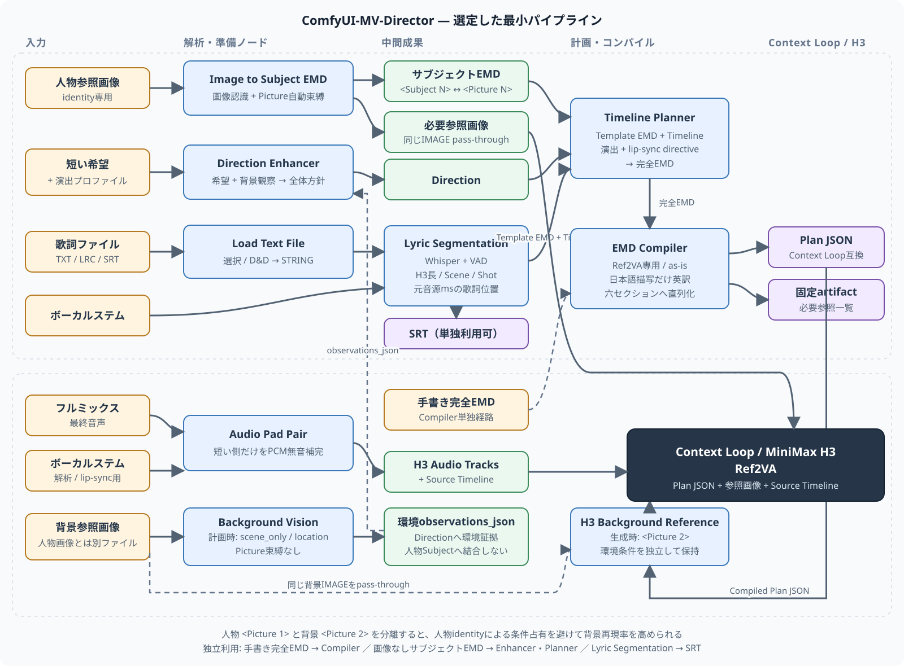

# ComfyUI-MV-Director

画像、歌詞、ボーカルステム、フルミックスから、MiniMax H3 / Context Loop用のMV計画を作るComfyUIカスタムノードです。VisionによるSubject EMD、演出方針、歌詞タイムライン、Shot計画を分離し、最後にRef2VA Plan JSONへコンパイルします。

EMDは **Easy MarkDown** の略です。Extended Markdownではありません。

## はじめに

1. [導入マニュアル](docs/installation.md)に従ってカスタムノード、`llama-cpp-python`、Whisper、各モデルを準備します。
2. [配布workflow](workflows/README.md)から、Context Loop標準、Audio参照、歌詞のいずれか一組を選びます。
3. [ノードマニュアル](docs/nodes/README.md)で各入力、出力、既定値、接続方法を確認します。
4. EMDを直接編集する場合は[EMD仕様書](docs/spec/emd-spec.md)を参照します。

基準環境はComfyUI v0.36.0 commit `ee71d5c4993f29086b27fde1629a945ae48425bf`、Context Loop 0.6.9 commit `9860a063784c8c23b58e00107f2180e0df3c43d9`です。

## 文書索引

| 場所 | 内容 |
|---|---|
| [`docs/`](docs/README.md) | 利用者向け・開発者向け文書の総合索引 |
| [`docs/nodes/`](docs/nodes/README.md) | 公開11ノードの操作マニュアル |
| [`docs/spec/`](docs/spec/README.md) | EMD、protocol、最小コアの規範仕様 |
| [`docs/implementation/`](docs/implementation/README.md) | 内部構造、公開surface、実装順序 |
| [`docs/research/`](docs/research/README.md) | Context Loop調査と仕様監査の記録 |
| [`docs/assets/`](docs/assets/README.md) | READMEや文書で使うPNG/SVG図版 |
| [`profiles/`](profiles/README.md) | ユーザー拡張可能なStyle、Motion、Camera profile EMD |
| [Direction / Planner処理フロー](docs/architecture/direction-planner-flow.md) | LLM task、Python所有処理、AS IS境界の図解 |
| [`workflows/`](workflows/README.md) | 三つのリップシンク方式に対応する6 workflow |

## 公開ノード

| 区分 | ノード | マニュアル |
|---|---|---|
| Core | Image to Subject EMD | [画像からSubject EMDを作る](docs/nodes/image-to-subject-emd.md) |
| Core | Direction Enhancer | [全体演出を作る](docs/nodes/direction-enhancer.md) |
| Core | Timeline Planner | [歌詞と時間枠へShotを計画する](docs/nodes/timeline-planner.md) |
| Core | EMD Compiler (Ref2VA) | [EMDをPlan JSONへ変換する](docs/nodes/emd-compiler.md) |
| Input | Lyric Segmentation | [歌詞、SRT、timelineを整列する](docs/nodes/lyric-segmentation.md) |
| Audio | Audio Pad Pair | [full mixとvocalをPCM無音で整える](docs/nodes/audio-pad-pair.md) |
| Utilities | H3 Timing Profile | [H3時間契約を共有する](docs/nodes/h3-timing-profile.md) |
| Utilities | 32-bit Seed | [再現可能なseedを分岐する](docs/nodes/seed32.md) |
| Utilities | String Combo | [有限文字列リストを選ぶ](docs/nodes/string-combo.md) |
| Utilities | Connected Combo | [サブグラフ内comboを外へ出す](docs/nodes/connected-combo.md) |
| Utilities | Load Text File | [UTF-8 lyricsファイルを読む](docs/nodes/load-text-file.md) |

ノードIDは`MVDirector...`、表示カテゴリは`MV Director/...`、内部socket型は`MV_DIRECTOR_...`です。旧プロトタイプとの互換aliasは登録しません。

## ライセンス

Copyright © 2026 `wsoldwolf`

ソースコードと文書は、別途明記された場合を除き[GNU General Public License v3.0 only](LICENSE)（`GPL-3.0-only`）です。

`assets/`の検証用楽曲、歌詞、ボーカルステム及び参照画像はソフトウェアライセンスの対象外です。対象素材と条件は[ASSET_LICENSES.md](ASSET_LICENSES.md)を参照してください。
