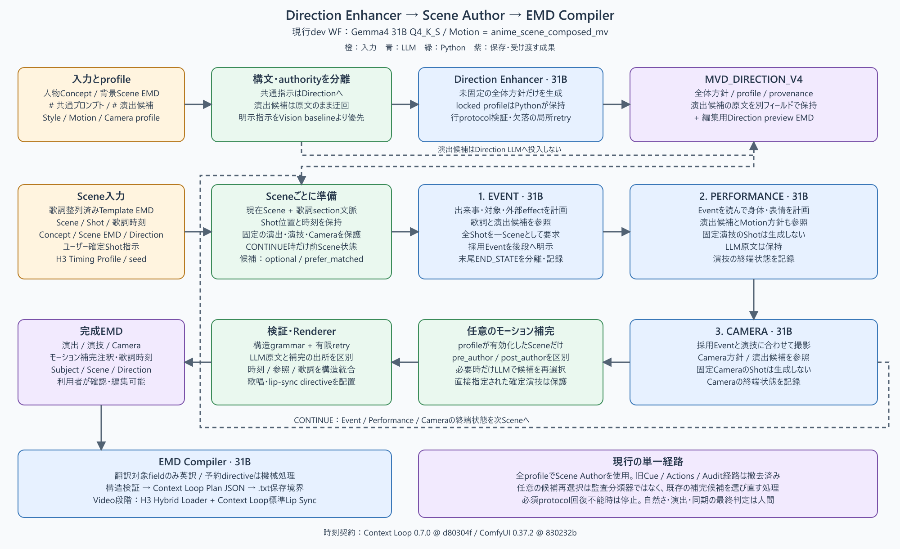

# Direction EnhancerとTimeline Plannerの処理フロー

図は現行dev workflowのScene Author経路です。人物・背景Vision、Enhancer、Planner、CompilerはGemma4 31B Q4_K_Sを使用します。歌詞整列はWhisper、動画生成はMiniMax H3の別責務です。青はLLM、緑はPython、橙は入力、紫は受け渡す成果です。

## 現行Planner：Scene Author

前段WFはStyleとCameraに`anime_emotional_mv`、Motionに`anime_scene_composed_mv`を指定します。Scene Authorはprofileによらず標準の単一経路です。Scene内の複数Shotを同じ要求に含め、現在Sceneと歌詞sectionの文脈、人物・背景EMD及びDirectionを渡します。

| 順序 | LLMの責務 | 次段へ渡す情報 |
|---|---|---|
| EVENT | 歌詞・演出候補から出来事、対象、外部effectを計画 | 採用Eventと出所 |
| PERFORMANCE | Eventに対応する身体・表情の演技を計画 | 採用演技。出来事と身体を別責務として保持 |
| CAMERA | Eventと演技を読んで撮影を計画 | Cameraと終端状態 |

Shotの`演出`、`演技`、`カメラ`に直接書かれた確定指示は保持し、該当fieldの生成を省略します。`END_STATE`は輸送用metadataとして自然文から分離し、`CONTINUE`の次Sceneだけへ各終端を渡します。CUTでは渡しません。映像上の完全な連続性を保証するものではありません。

`staging_candidate_policy=optional`は候補を任意の着想として扱います。`prefer_matched`は歌詞に適合する候補を優先して検討させます。全Sceneへの強制適用や、必ず対象が映像に出ることを保証する設定ではありません。

profileが明示的に有効化した場合だけモーション補完を合成します。`pre_author`は予定補完を演技生成前に提示し、Cameraへ合成済み演技を渡します。`post_author`はEvent・演技・Camera生成後に補完します。任意の`guarded_no_drop`ではLLMが既存の補完候補を選び直し、不正選択は一度再試行、回復不能なら元の候補を保持します。旧Action Auditとは別機能で、作者の確定演技・Cameraは変更しません。

Pythonは時刻、slot、構造grammar、protocol検証、有限retry及びEMD/JSONの組み立てを担当します。LLM原文を意味的に書き換えず、補完と歌唱・lip-sync directiveは別責務として合成し、出所を残します。「最終文はすべてLLM原文だけ」という設計ではありません。Compilerは翻訳対象fieldを英訳し、予約directiveとH3時間格子を機械処理してPlanを保存します。詳細は[Plannerノード](../nodes/timeline-planner.md)を参照してください。

編集用[SVG](../assets/direction-planner-flow.svg)は`python tools/generate_runtime_flow_diagram.py`で再生成します。更新時はPNGも再描画してください。

## Direction Enhancer

Direction Enhancerは`retention_policy`、人物`concept_emd`、背景`scene_emd`、Style/Motion/Camera profile及び`user_request`を受け取ります。`# 共通プロンプト`の希望は全Scene共通です。`# 演出候補`の箇条書きはPythonが構文だけを分離し、Direction LLMや全Scene共通の`prompt_prefix`には渡さず、同じtyped artifactに原文を保持します。外部profileの構造、固定section及びauthorityはPythonが検証し、LLMは固定されていない`STYLE`、`ENVIRONMENT`、`TIME_LIGHTING`、`MOTION`、`CAMERA`、`OTHER`行だけを返します。欠落slotは局所retryし、Pythonが`MVD_DIRECTION_V4`と人間向けpreviewを構築します。

Motion、Camera及びlocked Styleはprofile本文が所有し、LLMへ再生成させません。`scene_emd`は参照背景の構図を複製する入力ではなく、環境、時刻・照明baseline及び背景Pictureの根拠です。明示された利用者DirectionがVision観測より優先します。

## 旧Planne## 撤去済み経路と移行

旧Cue / Visual Beat / Song Direction / Shot Layout / Scene Spine / Actions / Audit /
有限Cameraの別経路は撤去しました。新しいScene Authorへ追加実行されません。
旧profile metadata、cache、scenes_per_batchの移行は[31B構成への移行](../implementation/gemma31b-migration.md)を参照してください。
