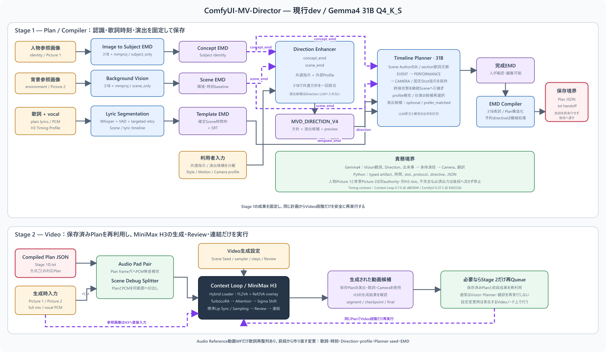

# プロジェクト概要

ComfyUI-MV-Directorは、利用者が完成promptを手書きしなくても、人物・背景画像、歌詞、ボーカル、楽曲からMiniMax H3 / Context Loop用のMV計画を組み立てるフロントエンドです。計画と動画生成を分離し、編集可能なEMDと再利用可能なPlan JSONを中間成果として残します。生成結果の美術的な採否は人間が判断します。

## 二段階の全体構成

配布workflowは、次の二段階を一対一の組として提供します。

1. **Plan / Compiler段階**: Vision、歌詞整列、Direction、Timeline Planner及び翻訳Compilerを実行し、EMD、SRT、Context Loop Plan JSONを保存します。
2. **Video段階**: 保存済みPlan JSON、人物・背景参照、full mix及びvocalを読みます。FL2VAベースにRef2VAを重ねるMiniMax H3 Hybrid LoaderからTurbo LoRA、Attention Backend、Sigma Shiftを経てSceneを生成、確認、連結します。Audio Reference方式のVideo workflowだけはScene音声の再配置用に歌詞整列を再実行します。

分離の主目的は、計画を固定したままVideo段階だけを再Queueし、同じ演出設計から生成結果を比較できるようにすることです。また、統合workflowの途中で停止した時にVision、Whisper、複数のPlanner LLM task、翻訳等の重い前段処理を繰り返す負担を避けます。前段成果を保存境界にすることで、失敗時の再開範囲とVRAMを占有するモデル群も分離できます。詳しい運用と再実行条件は[Plan / Videoを分離する理由](tips/two-stage-workflow.md)を参照してください。

## 四つのコア

1. Image to Subject EMDが参照画像の可視情報をSubjectとして記述します。
2. Direction Enhancerがスタイル、環境、時間・照明、モーション、カメラ、その他の全体方針を作ります。利用者の`# 演出候補`は共通指示から分離し、Planner専用の候補として保持します。
3. Timeline Plannerが確定済みScene枠へ歌詞Cue、Sceneごとの演出候補選択、Visual Beat、曲全体の演出弧、CUT/CONTINUE、Scene spine、人物動作、Action監査、カメラ及びリップシンク方式を段階的に展開します。外部現象を扱うScene spineは現象の終端状態を継続Sceneへ渡し、必要なShotでは現象と身体演技を同時に映すcoverageをCameraへ要求します。
4. EMD Compilerが日本語promptだけを英訳し、Ref2VA用Context Loop Plan JSONへ機械的に変換します。

人物参照と背景参照は別系統です。計画時は背景Visionが`scene_only`時に`emd_fragment`へ出すScene EMDをDirection EnhancerとPlannerの`scene_emd`へ渡し、動画生成時は同じ背景画像をH3の対応slotへ直接渡します。理由と推奨配線は[人物参照と背景参照を分ける](tips/separate-subject-and-background-references.md)を参照してください。

Direction EnhancerとTimeline Planner内部の詳しい流れは[処理フロー図](architecture/direction-planner-flow.md)を参照してください。DirectionのStyle、Motion、Cameraは[`profiles/`](../profiles/README.md)の外部EMDとして追加できます。現在の31B向け配布workflowはStyleとCameraに`anime_emotional_mv`、Motionに`anime_scene_composed_mv`を指定し、Scene Author経路を使用します。profile metadataからPlannerの感情演技、歌詞Cue、長尺Arc、顔Zoom及びScene継続方針も切り替えます。

Lyric Segmentationはこの経路と独立して歌詞、SRT、typed timelineを生成できます。Audio Pad Pairはfull mixとvocalを混合せず、PCM無音で必要尺へそろえます。

## EMD

EMDは **Easy MarkDown** です。人が確認・編集できる中間表現で、主に次を持ちます。

- `# サブジェクト`: 1 list itemを文書順に`<Subject 1..4>`へ割り当てます。行頭の``画像N``、``動画N``、``音声N``は任意のH3参照です。
- `# シーン設定`: 背景環境、観測時の時刻・照明baseline及び環境専用Pictureを持ちます。明示Directionが観測条件より優先します。
- `# 保持分析`: Subjectのどの識別要素を保持するかを記述します。
- `# 共通プロンプト`: 任意の`## スタイル`、`## 背景`、`## 時間・照明`、`## モーション`、`## カメラ`、`## その他`を持ちます。
- `# シーン`: `00:00.000`形式の絶対ms timeline、Shot、歌詞annotation、予約directiveを持ちます。

厳密な構文は[EMD仕様書](spec/emd-spec.md)を参照してください。

## LLMへ任せる範囲

Vision、演出、Shot計画、Action監査、英訳にはローカルGGUFを使いますが、JSONやEMDそのものをLLMへ生成させません。LLM応答は短い行指向protocolで受け、typed artifact、EMD、最終JSONはPythonが組み立てます。Plannerの合格Action自然文と自由文CameraはAS ISで保持します。`anime_emotional_mv`等の有限Cameraでは、LLMが選んだMotion Type、画角、経路及びcoverageをPythonが固定文へ直列化します。PythonはActionの意味を書き換えず、構造、時刻、slot、directive及び有限検証を担当します。

Compilerは補強、要約、並べ替えをせず、EMD文法と予約directiveを機械的に処理します。作者が書いた`<d>...</d>`は翻訳せず、そのままH3へ渡します。

## リップシンク方式

- `context_loop`: Context Loop標準のsource vocal駆動。
- `audio_reference`: Sceneに対応する`<Audio N>`参照による駆動。
- `lyrics`: Shotの歌詞directiveによる粗い時間誘導。音素単位の完全同期は保証しません。
- `off`: リップシンクdirectiveを出力しません。

歌詞annotationは全方式でEMDに残り、人物動作の材料になります。最終音声を何にするかはPlannerやEMDではなく、動画生成workflowのChain Policyが決定します。

## 時間と無音

EMDは`00:00.000`表記、内部timelineは整数msを使います。H3 Scene長は固定Timing Profileに従うframe数が正本です。音源がframe境界より短い場合はAudio Pad PairがPCM無音を追加します。promptに「無音」と書くことだけでは真の無音を保証しません。

## 対象環境と方針

- 主対象は8GB VRAM、4Bまたは8B級のローカルGGUFです。Vision以外の生成・英訳は8Bを推奨します。
- CompilerはRef2VA専用です。T2VAやI2VAは別Compilerの責務です。
- 旧workflow、node ID、schemaとの互換性は持ちません。PCM処理、GGUF探索等、責務が変わらない実装資産だけを再利用します。
- 基準はComfyUI `ee71d5c4993f29086b27fde1629a945ae48425bf`、Context Loop `9860a063784c8c23b58e00107f2180e0df3c43d9`です。
