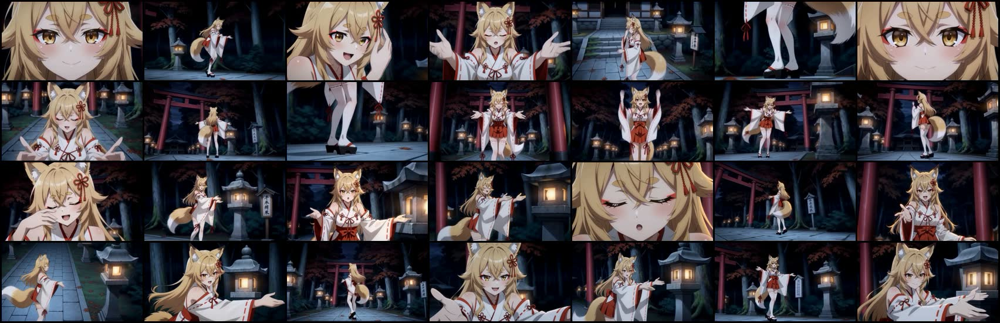
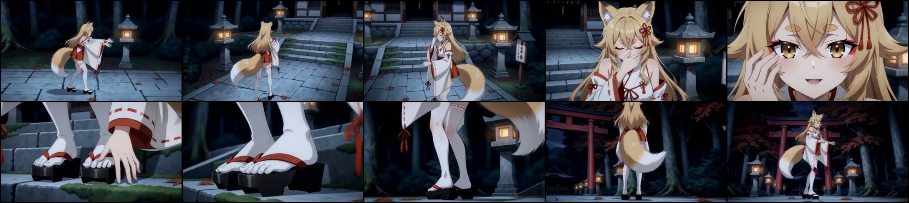
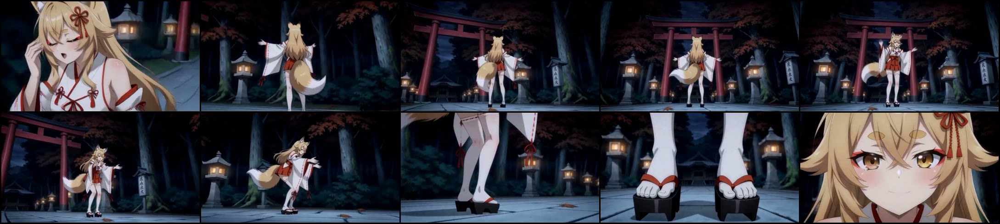

# `anime_emotional_mv` Context Loop 6 生成結果評価

## 対象

- 完成動画: `C:\Software\ComfyUI\output\h3_chains\mv_director_context_loop-6\final\t2v_normal_2026-09-19.mp4`
- 使用Plan: `C:\Software\ComfyUI\output\mv_director\context_loop_plan_00004.txt`
- 使用EMD: `C:\Software\ComfyUI\output\mv_director\context_loop_emd_00005.md`
- 動画仕様: 864×480、24 fps、3,369 frames、140.375秒
- 評価日: 2026-09-19

本書は、完成動画の目視、動画へ埋め込まれたComfyUI prompt metadata、Plan及びEMDを対応付けた追跡評価である。ここでは原因の特定と次の改修条件を記録し、実装変更は行わない。

## 結論

`anime_emotional_mv`プロファイルはPlanner及び最終promptへ到達している。したがって、今回の足袋崩壊、前傾姿勢及び両腕を広げる演技の反復は、プロファイルが未接続だからではない。

主因は次の三層にある。

1. Plannerが各Shotへ、プロファイルと矛盾する「前傾」「腕又は手を前方へ大きく開く」「足又は足指を見せる」「石灯籠へ接近する」指示を大量に生成している。
2. 現在の品質検査は表層文字列の近似重複を主に扱い、同じ意味を別表現にした反復を取り逃す。再試行後も違反を警告として受理するため、矛盾したShotがAS ISでCompilerへ渡る。
3. Compilerの翻訳が`足袋`を`white geta`へ誤訳し、`下駄`と同じ履物として二重化している。さらに、足指、皮膚、爪及び五趾を否定する長文が、結果的にそれらの視覚概念を繰り返し活性化している。

H3はグローバルなプロファイルよりも、現在Shotに近い具体的な`detailed_description`を強く追従している。従って、グローバル制約をさらに長くするだけでは解決せず、Planner出力の意味検査と翻訳語彙の保護が必要である。

## 映像の概観

良化した点も確認できる。

- 左右分割や同一人物の明瞭な複製は、このコンタクトシートでは支配的ではない。
- 夜間の神社・森という背景は概ね維持される。
- 顔寄り、全身、Arcを含む画角変化は以前より増えた。
- 閉眼を含む一部の目の変化と、人物同一性の維持が見られる。

一方、画角が変わっても人物演技の骨格が「胴体を前へ倒す」「腕又は手を前方へ開く」「石灯籠の近傍に立つ」へ戻るため、長編全体では同じ演技の反復に見える。

## 定量確認

EMDの詳細Shot 57件を意味単位で分類した結果は次の通りである。同じ語を使わない言い換えも同一系列として数えた。

| 系列 | 該当Shot | 該当Scene | 観察 |
|---|---:|---|---|
| 前傾又は胸郭を前へ運ぶ | 25 / 57 | 1, 2, 4–12, 14–16 | ほぼ全編で終端姿勢として再利用 |
| 腕・手を前方又は左右へ開く | 18 / 57 | 1, 2, 5, 6, 9–12, 14–16 | 感情差に関係なく同じsilhouetteへ収束 |
| 石灯籠 | 39 / 57 | 2–16 | 歌詞で選ばれていない背景設備が演技対象化 |
| 鳥居 | 49 / 57 | 1–16 | Sceneの空間語彙がほぼ固定 |
| 足・足指・履物 | 14 / 57 | 1, 2, 4–9, 13–15 | 足元を主題にしないプロファイルと衝突 |

Camera Motion Typeの内訳は、`Arc Shot` 22、`Zoom In` 19、`Tracking Shot` 5、`Pan Left` 4、`Tilt Down` 4である。Arc自体は不足していないが、ArcとZoomが41 / 57を占め、人物の演技と被写体ターゲットが反復している。Cameraの種類だけを増やしても、身体演技の終端姿勢が同じなら変化は弱い。

## 足袋崩壊の映像証拠

### 約20–30秒

約25–26秒で足元が直接主題となり、白い足袋の布面ではなく、五本の指が個別に分離し、爪まで描写される。これは単なる遠景での小さな作画崩れではなく、Shot設計が足指を視認できる距離へ誘導した上で発生している。

### 約40–50秒

約48秒にも同系統の足元寄りがあり、裸足状に分離した足指と爪が再発する。この区間では前傾姿勢も近接して現れ、足元と上体の反復が同じScene系列に混在する。

## プロファイルは到達している

使用EMDには次の制約が実際に含まれている。

- 白い足袋は全ての指、皮膚及び爪を覆う不透明な布製履物とする。
- つま先の割れは親指と残り四趾の間の一か所だけとする。
- 足袋、足指、下駄又は地面を接写の主題にしない。
- 両腕を広げるpose、単なる歩行及び既設設備への接触を主動作として反復しない。
- 固定設備は現在Sceneの歌詞又は作者指示が選ばない限り、接近先や演技の目的にしない。

この内容は[`profiles/style/anime_emotional_mv.md`](../../profiles/style/anime_emotional_mv.md)及び[`profiles/motion/anime_emotional_mv.md`](../../profiles/motion/anime_emotional_mv.md)にも存在する。その一方で、同じEMDの局所Shotには以下のような指示が繰り返される。

- 身体を前傾させる。
- 胸郭をひねって前へ運ぶ。
- 腕又は手を前方へ大きく開く。
- 足又は足指を石畳へ押し付ける。
- `Tilt Down`で石灯籠へ移動する。
- 石灯籠を視線、接近又は動作の基準にする。

つまり、プロファイルの一般禁止と、Shotの具体的な肯定指示が同居している。動画モデルから見れば「描かないでほしい一般文」より「このShotで描く具体文」の方が実行しやすく、局所指示が勝っている。

## Planner側の根本原因

現在のPlanner system promptにも、両腕を広げる反復、歌詞にない石灯籠、未要求の足元寄りを避ける規則は既に存在する。しかし8Bモデルは、語を入れ替えて同じ演技を生成している。

[`core/planner/engine.py`](../../core/planner/engine.py)の現行検査には二つの限界がある。

1. 近似重複判定は主に文字列類似度を使うため、「前へ身を傾ける」「胸郭を前へ運ぶ」「上体を深く倒す」のような意味上同一の言い換えを別動作として通しやすい。
2. 品質再試行後に違反が残っても、`repetition_warnings`として受理できる。AS IS原則は守られるが、違反したLLM出力まで最終成果へ通るfail-openになっている。

既存の下半身検査は`足元`、`足先`、`足袋`、`下駄`、`toe`、`foot`等を検出できる。しかし「前傾」「胸郭を前へ」「腕を伸ばす」「手を大きく開く」「背景設備を行動対象にする」という意味系列は、現在の有限な表層パターンでは十分に扱えない。

## Compiler側の根本原因

最終Planでは、被写体とスタイルの翻訳に次の意味崩壊がある。

- `白い足袋`が`white geta`へ変換される。
- `黒い木下駄`も別に`black wooden geta`として残る。
- 結果として、白い下駄と黒い下駄を同時に着用するような矛盾した履物指定になる。
- 禁止説明の中で`toes`、`skin`、`nails`、`five toes`等が何度も反復される。

Camera文にも空白欠落又は命令混入があり、`Arc Shot with large amplitude at fast speedThe...`、`Tracking Shotuse it`、`Tilt DownLower...`のように形式名と本文が連結している。これは足袋崩壊の直接原因ではないが、H3のCamera命令解釈を不安定にする。

## 推奨する最小改修

大幅な仕様変更を避け、AS IS原則を保つなら、次の順が妥当である。

1. **Action出力へLLM意味監査を追加する。** 監査LLMは各slotを`pass`又は理由コード付き`reject`として返す。Pythonは文章を書き換えず、rejectされたslotだけを再生成する。
2. **`anime_emotional_mv`ではfail-closedにする。** 意味上の演技反復、歌詞にない固定設備、未要求の下半身寄り、プロファイル矛盾が再試行後も残る場合は、警告受理せずPlannerを未完成として停止する。
3. **直前文面ではなく意味履歴を再試行へ渡す。** `forward_lean`、`open_arms`、`fixture_contact`、`lower_body_detail`のような少数の意味コードと、開始・終端silhouetteを履歴化する。これは映像文をPythonが生成する処理ではなく、LLM出力を選別する契約である。
4. **翻訳語彙を保護する。** 少なくとも`足袋 → tabi / split-toe socks`、`下駄 → geta`、`鼻緒 → hanao strap`を固定し、`足袋`を`geta`へ翻訳できないようにする。
5. **足袋promptを短い肯定形へ正規化する。** 例えば`opaque white split-toe tabi with a smooth continuous cloth toe; black wooden geta with red hanao`を中心にし、足元が主題でないShotへ爪・裸足・五本指等の禁止語を繰り返し注入しない。
6. **Camera行を構造検査する。** 正式なMotion Typeを行頭へ一つだけ置き、Typeと本文間の空白、速度及び振幅をCompiler出力時に検証する。違反時は翻訳slotだけを再試行する。

ここで重要なのは、Pythonが任意の演技文を後処理で置換しないことである。Pythonは有限個の契約違反を検出し、LLMへ再生成を要求するだけに留めれば、Planner生成結果をAS ISでCompilerへ渡す原則を維持できる。

## 受入基準

次回生成では、映像を見る前にEMD及びPlanで次を満たすことを推奨する。

| 項目 | 合格条件 |
|---|---|
| 意味上の演技反復 | 許可された歌詞motifを除き、同一系列を連続Sceneへ再使用しない |
| 前傾 | 楽曲又は歌詞に対応する一回の明確なaccentを除き反復しない |
| 両腕を広げるpose | 感情の既定poseにせず、同じ終端silhouetteを再使用しない |
| 石灯籠 | 現在Sceneの歌詞又は作者指示で選択されない限り、接近・接触・注視対象を0件にする |
| 足元 | 歌詞又は作者指示にない足・足指・履物のclose-upを0件にする |
| 足袋翻訳 | `tabi`と`geta`を別の物として保持し、`white geta`を0件にする |
| Camera形式 | 連結欠損、複数Type、未知Typeを0件にする |

この受入基準をPlan生成直後に適用すれば、140秒の動画を最後まで生成してから同じ破綻を発見するコストを抑えられる。

## 実装追記

同日、上記の最小改修を現行構成へ適用した。

- 同じPlanner LLMを分類専用に再利用する`action-audit`を追加した。監査は有限理由codeだけを返し、Action本文を書き換えない。
- rejectされたAction slotだけを一回再生成し、最終auditを一回行う。構造違反と表層反復はaudit rejectと同じ修復loopへ統合し、一度目の品質retry後にaudit前停止しない。実機8Bでは全slotを相互にrejectし続ける現象が確認され、十回修復ではGPUにかかわらずLLM呼び出し回数が過大になったため、auditを初回と最終の最大二回へ縮小した。各roundで最小違反のLLM候補を保持し、Action audit枯渇時はその候補をAS IS採用して理由をWARNINGへ残す。Cameraも一回の品質retry後は初回と再生成の最小違反候補をAS IS採用し、必須slot欠落又はprotocol回復失敗だけを停止条件とする。
- `足袋`、`下駄`及び`鼻緒`を翻訳入力から分離し、`tabi`、`geta`及び`hanao strap`として機械的に区別した。
- `anime_emotional_mv`の足袋styleを、否定語の列挙から短い肯定形へ変更した。
- Camera行を正式Motion Type一個だけに制限し、protected Camera句と英訳本文の間へ必要な一空白を復元するようにした。

プロトタイプの完全なSong Bible blockは移植していない。現行の短いSong Directionは維持し、まず今回の直接原因であるAction採用判定と翻訳語彙を修正した。Song Bible相当の全曲・section別motif台帳は、次回PlanのAction多様性と歌詞追従を確認してから追加要否を判断する。
