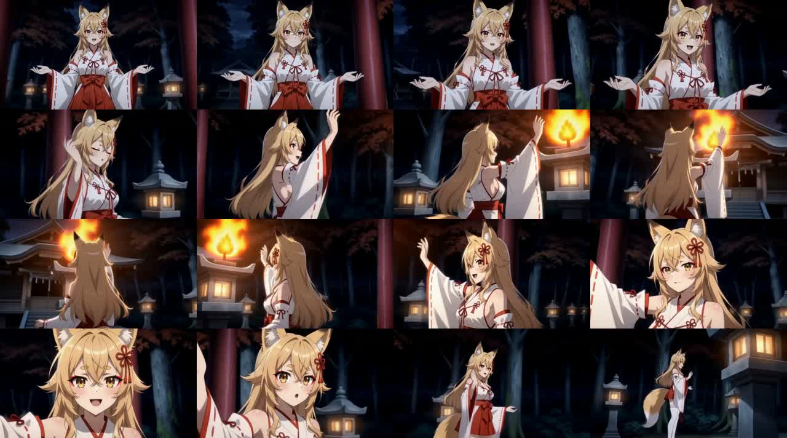
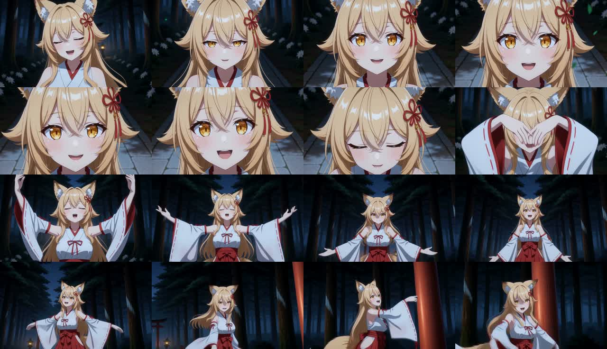

# 完成動画評価：身体演技とCameraの同期（2026-09-20）

## 判断

今回の不足は、Arcや顔アップの数よりも、**人物の演技を一連の振付として生成することと、その山場へCameraを合わせること**にある。
顔の寄り、閉眼、画角変化、継続Sceneは確認できた。一方、局所Actionは手振り・手伸ばし・歩行へ偏り、
身体の支持、重心、胴体、腕を連動させた動作がほとんど書かれていない。
生成映像にも片腕を上げたまま視点が変わる区間があり、ユーザーが求めるダンスのような演技との差はEMD段階から存在する。

最初の改修は、既存Visual Beatの身体主導・終端とActionを使って短い演技フレーズを作り、
Cameraへ同じフレーズの位相を渡すこととする。8Bの変更や全曲監査の追加を先に行う根拠はない。
本書は分析と計画であり、ノード、プロファイル、プロンプト、WFの動作変更は行っていない。

## 対象と確認方法

- 完成動画：`C:/Software/ComfyUI/output/h3_chains/mv_director_context_loop/final/t2v_normal_2026-09-20.mp4`
- 入力Plan：`C:/Software/ComfyUI/output/mv_director/context_loop_plan_00001.txt`
- 対応EMD：`C:/Software/ComfyUI/output/mv_director/context_loop_emd_00001.md`
- 旧8B動画：`E:/OutputCollection/MiniMaxH3 Assets/千年鳥居-v1/ref2v_2026-09-12-8b.mp4`
- 実装の参照点：commit `cfe8ca2`。当日の導入マニュアルとそのテストの未コミット変更は分析対象外。

今回の動画は864×480、24fps、140.375秒、3369配信frame。
埋め込み`prompt`のLoad Text Fileに保存されたPlanを復号し、ディスク上の上記Planとバイト単位で一致することを確認した。
SHA-256は`2fc7eea41181a8acff9ccbd12a3273d035b3a60b2e0d58696027df12adbf69eb`。
動画内の`h3_plan.shots`と`h3_manifest`も確認した。正規化済み`editor_plan`は入力JSON全体とは一致しないため、
入力の同一性は復号したLoad Text Fileで、実採用条件は`h3_plan`で確認している。
評価対象は過去のEMD 00015そのものではなく、今回の動画に結び付く00001である。

全編を約3秒間隔のフレームで確認し、20–28秒、74–82秒、112–120秒を0.5秒間隔で追加確認した。
旧8Bは冒頭約96秒の4秒間隔フレームと6–14秒の0.5秒間隔フレーム、埋め込みPlanを確認した。
これは連続フレームと指示の照合であり、全frameの運動解析、実時間の全編視聴、音楽の拍位置測定は行っていない。
したがって細かな加速度や拍との誤差を数値評価したものではない。

## 実出力の分布

| 指標 | 今回の結果 | 読み取り |
|---|---|---|
| Scene / EMD Shot | 16 / 51 | 一つのSceneが複数の短い演技指示に分かれる |
| 初回を含む非継続 / 継続 | 4 / 12 | 継続不足そのものではない。継続は22frame、guide |
| Arc Shot | 14 / 51 | Arcは存在する。軌道と演技を結び付ける必要がある |
| Zoom In / Zoom Out | 10 / 3 | 顔への接近は存在する |
| Push/Pull、Truck、Pan、Pedestal、Static | 8、7、4、3、2 | Motion Typeの種類は既に分散している |
| Actionに「手」又は「腕」 | 28 / 51 | 手の語があることは振付が豊かなことを意味しない |
| Actionに「右手」 | 15 / 51 | 特定の片腕への偏り |
| Actionに「重心・体重・支持脚・膝・骨盤・ステップ・ダンス・舞踊」のいずれか | 2 / 51 | 2件ともScene12の同一歩行文の「体重」。踊る身体の組織化がない |

語数集計はEMDのAction行だけを対象にした再現可能な文字列検査であり、映像中の動作率や意味品質の自動採点ではない。
全尺÷Shot数は約2.75秒。旧8Bの21Shot・約139秒という過去の集計では約6.6秒だった。
これは粗い密度比較であり、同一のカット点や拍位置で比較した平均ではない。

## 時間対応で見える問題

| 動画時刻の目安 | EMD / Plan | 抽出フレームからの評価 |
|---|---|---|
| 0–9秒 | 「右手を大きく振り上げ」「太陽」「暁」、Zoom Inを連続 | 腕上げと寄りはある。夜のDirectionに対し強い明るさが発生。演技以前に局所指示が競合 |
| 20–28秒 | 「苔の上空で右手を振る」「苔へと還るように手を振る」「苔に還る」 | 苔の塊は見えるが、手振りと顔寄りから全身・背面へ移る。苔に固有の接触や質感を使った演技になっていない |
| 29–39秒 | 「契り」を追う・掴む・地面に置く | 抽象語を物体化する上流の誤りが残る。この段階の不明瞭さはダンス指定だけでは解消しない |
| 74–82秒 | 「狐火の上部に右手を伸ばし、その光を消す」等、Arc→Truck→Arc | 開いた手から片腕を頭上へ上げる。炎は灯籠付近に現れ、姿勢を保ったまま視点と画角が変わる |
| 93–113秒 | 石畳を進む、鳥居へ到達する文が連続。Scene12の先頭2Actionは同文 | 歩行の目的地はあるが、歌唱と連動する振付が弱い。Scene12先頭では歩行Actionに顔Zoomが指定される |
| 112–120秒 | 空へ手を示す、光を放つ、右手を上げ左手を胸へ | 閉眼・笑顔・両手の変化は見える。現行でも表情と腕は動くが、下半身と胴体は相対的に静か |
| 120秒付近 | 狐火を手に取り、空へ放つ | 手元の炎が見える。外部自律effectという共通方針と局所Actionの不整合 |

今回74秒付近から約8秒。左上から右へ、行順に約0.5秒間隔。

旧8Bの6秒付近から約8秒。閉眼と顔の寄りから、両腕が顔の前を通り、頭上へ上がり、外側へ開き、
腕が下がるにつれて身体の向きと見える範囲も変わる。開腕という単独の姿勢ではなく、そこまでの経路と次の動作が読める。

旧8Bにも歩行と開腕の反復はある。成功点はそのポーズを禁止解除して増やすことではなく、
動作を連続させ、身体を見せる時と表情を見せる時を分けていること。
旧PlanのScene2には左右の腕の異なる動きと`First / Next / Finally`の順序、動作を捉える接近がある。
ただし具体的な画面上の振付の全てがPlanに明記されているわけではなく、H3側の補完も含まれる。
モデル・参照画像・生成設定も完全同一ではないため、システムプロンプトだけによる差だとは断定しない。

## 原因の整理

### 1. 共通Directionは届いているが、身体演技を弱める条件がある

[`generate_planner_content`](../../core/planner/engine.py)はActionへstyle・time_lighting・motion・otherを送り、
Cameraへstyle・time_lighting・camera・otherと`locked_action`を送る。
「プロファイルがPlannerへ全く渡っていない」という仮説は現在の実装とは一致しない。

[`anime_emotional_mv` Motion](../../profiles/motion/anime_emotional_mv.md)には強い感情や加速の指示もあるが、
必要な部分だけ、物体が主役なら静止又は一度の短い反応、という例外がある。
さらにbounded policyは`whole_body_emotion_mode`を`only_parts_needed_for_the_event`へ上書きする。
[`bounded Beat`](../../prompts/timeline_planner_visual_beats_bounded_system_prompt.txt)は具体物がない場合も
「身体の小さな意図ある動き」を求める。
これらは物体への過剰接触を防ぐためには有効だが、歌詞のある区間を人物のパフォーマンスとして扱う力が弱い。

対象の選択・物性を縛る方針と、歌唱する人物の演技強度を決める方針を独立させる必要がある。
狐火は手で操作せず空間を動き、人物は同じ歌唱フレーズを身体で表現する、という共存を許す。

### 2. 足元の接写防止が、振付のステップまで弱める

[`Action prompt`](../../prompts/timeline_planner_actions_system_prompt.txt)は脚とステップをsupport mechanicsとする。
個々の指や足袋を主役にしない方針は維持しつつ、全身で読める横ステップ、踏み替え、膝の屈伸、
体重移動は演技の主動作として許可した方がよい。
走行や同じ場所での連続回転を追加する必要はない。

### 3. Scene継続と振付・Cameraの継続は別

`previous_shot`は前のScene番号とShot番号を指すだけで、関節や重心の終了状態ではない。
bounded経路ではコピー反復を避けるため`recent_action_history`と`previous_batch_action`等を生成requestから除外している。
この措置は反復抑制の意図があるが、同じ演技を次区間へ受け渡す短い状態情報も乏しくなる。

今回は12SceneがCONTINUEであるのに、隣接Cameraで画角・視点が再設定される。
例えばScene2の先頭Arcはupper-body/front-three-quarterへ着地するが、次はwide/front-three-quarterからPush Inを開始する。
これは必ず失敗する指示とは言えないものの、継続Arcから顔へ自然に寄る設計にはなっていない。
履歴全文を再投入するより、現在フレーズの終了状態とCamera終端だけを短く引き継ぐ方が適切である。

### 4. 現行Camera protocolには演技への同期を保存する場所がない

[`finite_v1`](../../prompts/timeline_planner_cameras_system_prompt.txt)はMotion、開始・終了scale/view、Path、Coverageの七項目。
速度変化の位相、動作の山場、接近を始める合図は表現できない。
Arcの70–90%、Zoomの35–55%という固定の尺割合があり、Actionの実際の変化とは独立している。
このため自然文のシステムプロンプトだけを強化しても、形式化の時点で時間的な関係を落とす。

Cameraの英文定型は`_render_camera_plan`の仕様でもあり、それだけでLLM失敗やfallbackと判断しない。
今回のfallback件数はraw trace未取得のため確定していない。
ただし有限検査はMotion/Path等を確認する一方、Zoomの開始・終了視点の整合などは十分に拘束していない。
実出力のScene6先頭はZoom Outなのにfrontalからover-shoulderへ変わる。
演技が被写体回転を指示していない場面でこれを解釈させると、意図しない身体回転や構図変更の余地ができる。

### 5. H3へ渡す固定文も大きい

実採用`prompt_prefix`は11,095文字、Sceneごとの最終promptは16,762–18,539文字。
`detailed_description`は全体の約1.7–10.5%だった。文字数比でありtoken比や注意配分の測定ではない。
短いActionに対し、識別・禁止・Camera一般論が大きいという構成上の懸念がある。

さらに「不透明」が`translucent`になる箇所、夜間なのに局所Actionに太陽がある箇所もある。
身体演技の改修と同時に大量の共通文を変更すると原因を切り分けられないため、整理は別比較にする。

## 改善計画

### P0：既存の生成段階で演技を一つのフレーズにする

`anime_emotional_mv`だけで、人物の感情表現を「歌唱に伴うダンス的な全身演技」へ明示する。
設定はユーザーの希望どおりprofileファイルで切り替えられる形にし、UI追加は不要とする。
Sceneの対象具体化は従来のautomatic Cueを保持する。

最初はBEATの既存九項目を維持し、`身体主導`を一つの連続した演技フレーズ、`終端`を次へ渡す終了状態にする。
具体的には重心と支持、胴体と腕の経路、視線又は短い表情変化のうち必要な組合せを選び、
短い準備、はっきりしたアクセント、余韻を時間順に書く。
全Shotへ同じ三動作を要求せず、同じフレーズを1〜3Shotへ分配する。
顔Shotは動作の途中に独立した別演技を差し込まず、表情を読ませる局面として扱う。

歌詞に「踊る」がなくても感情に適した踏み替えや身体のしなりを許可する。
具体物のない区間を必ず小さな反応に縮めず、サビでは振幅を大きく、静かな節では溜めを使えるようにする。
物体・外部effectの具現化と人物の演技は両立させるが、毎対象に接触を強制しない。
「苔・花・狐火・御神木」を全Sceneの固定辞書や必須小道具に戻さない。

### P1：演技の位相をCameraへ渡す

P0で改善した短い区間を使い、既存Camera taskへ同じ演技フレーズと終了状態を読み取り専用で渡す。
Actionの原文をPythonが再解釈・要約して同期点を推測する方式にはしない。
同期点はLLMが明示した演技位相、又は既存の歌詞境界を参照する。

最小の内部仕様案は、Cameraの七項目に`SYNC`一項目だけを追加した新versionを設け、
フレーズ全体・アクセント・解放等の有限な位相を選ばせること。
開始・終了時間は同じAction側の時間配分と共有し、Cameraだけが独立して山場を発明しない。
既存BEAT本文で位相を曖昧なく保持できない場合にだけ、短い構造化fieldを追加する。
この部分は実装前に、位相参照元・時間単位・省略時の挙動を仕様として確定する。

長いArcは演技の準備から展開を撮り、アクセントを身体が読める画角で受け、
手や胴体の動きが完了してから顔へ接近する。次のShotは前Cameraの終端から開始する。
人物を自転させてCameraの回り込みを代用しない。
ズーム単独は視点を変えず、Arcから顔への半径変化又は次Shotへの接続を明示的に扱う。
一Shotに無関係なMotion Typeを多数詰め込まず、成立する経路と引継ぎを限定して扱う。

最終EMDのAction/Camera行、Compiler JSON、WFの外部接続は維持する方針。
Actionの創作本文はLLM生成のまま使い、Cameraは既存と同じ明示的な選択値の直列化に限定する。
Pythonによる振付文の補作・名詞別ルール・意味の書換えは加えない。

### P2：必要なら音楽の拍と固定文を別々に改善

現在のPlannerは歌詞時刻とScene尺を持つが、音声波形や拍・小節の時刻列を受け取っていない。
歌詞フレーズに合う演技とCameraの同期はP0/P1で改善できるが、伴奏の強拍への正確な一致とは別である。
まず既存歌詞の入り・終わりを使い、BPMをLLMへ推測させない。
間奏を含む拍同期が必要と実測された段階で、フルミックスから軽量な拍候補を抽出し、
信頼度が低ければ歌詞フレーズ基準へ戻す追加案を検討する。追加の大規模LLMやVisionは不要。

別の比較ではH3向けの共通文からPlanner用の配分規則や重複を整理し、識別・単一人物・背景等の必要条件と
そのSceneで採用された具体指示へ集約する。翻訳の不透明/半透明の逆転も独立して確認する。

## 小規模な検証と進め方

最初の実装対象はP0。その後P1を加える二段階とし、新LLM taskや監査回数を増やさない。
対象Sceneだけを既存Scene Debug Splitterで比較し、全曲の再生成を毎回行わない。

| 比較区間 | 確認事項 |
|---|---|
| 対象語に依存しない歌唱区間 | 手振りだけでなく、支持・重心・胴体・腕が連動する。単純歩行へ戻らない |
| 苔のScene3 | 自然な支持面と一度の出来事があり、演技を入れても対象が消えない |
| 狐火のScene9とその前後 | 炎が空間を動き、手に保持・消火させず、人物の演技と両立する |
| 後半の顔遷移を含む区間 | 全身演技の山場を見せてから顔へ入り、目・眉・口が読める。次区間の開始姿勢・Cameraがつながる |

固定する条件はGGUF hash、Planner seed・温度、H3 seed、参照画像、音源、LoRA、steps、解像度。
まず同一seedで「現状→P0→P0+P1」を比較し、良くなった案を別の2seedでも確認する。
旧8B動画は表現の参照であり、このA/Bの対照群にはしない。

採点は実LLMの採択文とレンダリング結果で分ける。

- Action：短い演技フレーズの順序、支持・重心の変化、同じ手振りの反復、Cueの維持。
- Camera：演技の山場の可視性、顔への移行時点、前Shotの終端との整合、実際の身体回転の有無。
- 映像：動作が連続して読めるか、静止と加速の対比、足の滑り・破綻、顔・口の可視性。
- 費用：推論call数・token数・所要時間・修復数。5060で未測定の性能を5090の結果から保証しない。

構造テストは位相参照の範囲、Cameraの物理的整合、継続引継ぎ、ActionのAS IS保持に限定する。
意味品質の判定だけで全曲を停止させる条件や、新しい10回監査ループを追加しない。
踊るように見えるかという最終判定は、語彙の出現数やFake backendの成功では代用しない。

## 関連資料

- [プロトタイプ8Bとの創作差分](prototype-8b-creative-regression-analysis-2026-09-20.md)
- [Planner v54の対象抽出と転送](planner-v54-lyric-cue-discovery-2026-09-20.md)
- [Direction / Plannerの処理フロー](../architecture/direction-planner-flow.md)

本書の比較画像は、上記ユーザー提供動画から抽出した分析用フレーム。元動画と抽出時刻は本文に記載した。
