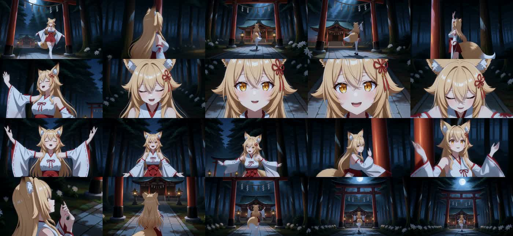
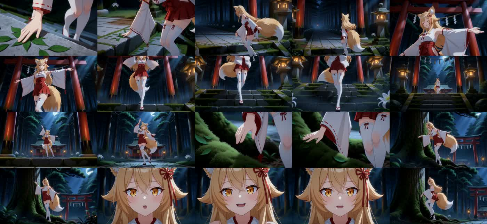
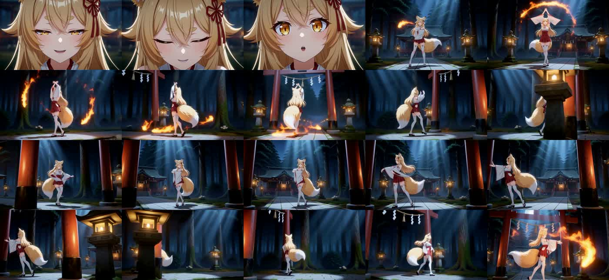

# cl-japanese2json のプロンプト生成と現行 MV Director の差

調査日: 2026-09-21  
対象動画: `ref2v_2026-09-12-8b.mp4`、`ref2v_2026-09-12-27b.mp4`  
目的: 人物演技とカメラワークの連動が旧版で強く、現行版で弱く感じられる理由を、実際の生成指示・映像・ソースから切り分ける。

## 結論

**主因は「Arc Shot の数」でも「8B に表現力がないこと」でもない。旧版では、歌詞から選んだ出来事、人物の時間順の動作、物体・効果の変化、構図、カメラの開始・経路・終点を、長めの Scene／Shot にまとめて計画し、H3 に一緒に渡していた。現行版ではこれらを個別の短い slot に分解し、カメラを Action の確定後に割り当てるため、各出力が形式上正しくても、一つの演技を撮り続ける時間的・空間的な結合が弱くなる。**

これは単一の関数バグではなく、計画の責務分離と生成契約のトレードオフである。ただし、旧版の全面復帰は不要かつ危険。旧版にも歩行・開腕・身体回転の反復、参照外の接触、不正確な英文がある。残すべきなのは、歌詞の出来事を Scene 内で完結させる設計と、演技の転換点に結び付いたカメラ経路である。

現行コードは既に Action のフレーズ分配、Camera の継続構図、4秒以上の通常 Shot 候補などを追加している。本報告でいう「現行版の劣化」は主に[9月20日の完成動画分析](loop2-performance-regression-review-2026-09-20.md)と、その後も残るコード上の結合不足を指す。**現 dev HEAD の全曲動画を同条件で新規生成・採点した結論ではない。**

## 証拠と比較条件

2本の MP4 の埋め込み `prompt` と `h3_plan` から、ComfyUI の実行グラフ、モデル設定、H3 に渡された JSON の `shots[].prompt` を復元した。動画は全編を5秒ごと、8B冒頭および27Bの苔・狐火周辺を1秒ごとに抽出して時系列で確認した。静止画系列から軌道の瞬間速度・拍同期の精度までは測れない。

対象の同定用 SHA-256: 8B `5870fb484bc49c320253e59dbf0f03883621b91e5e73f8dfc2f73fb9f3d817c2`、27B `3f5b183fd192ea6055d707456ebcad88469e18ed7b5823a155bb819d6bcd98a1`。メタデータは `ffprobe -v error -show_entries format_tags=prompt,h3_plan -of json <動画>` で抽出できる。非常に大きい JSON なので、全体を画面へ出すのではなく対象 field だけを解析した。

| 項目 | 旧8B | 旧27B | 9月20日の現行比較例 |
|---|---:|---:|---:|
| Planner LLM / profile | Qwen3 8B / `lyric_visuals_light_8b` | Qwen3.8 27B / `lyric_visuals_full` | 8B / `anime_emotional_mv` |
| H3 Scene | 13 | 13 | 16 |
| 内部 Shot | 21 | 29 | 52 |
| `detailed_description` の Arc 主動作 | 6 | 8 | 15（[既存調査](loop2-performance-regression-review-2026-09-20.md)） |
| 内部 Shot 長の中央値 | 7.00秒 | 4.58秒 | 約2.48秒 |
| 2.5秒未満の Shot | 4/21 | 3/29 | 27/52 |
| Planner `max_tokens` / `retry_max` | 8192 / 10 | 8192 / 10 | 現行ノード既定4096 / 段階別の再試行 |

旧版の内部 Shot 長は各 Scene の raw H3 長と `[Shot N] At ...` から算出した。Scene 間の重なりがあるため、その合計150秒と完成 MP4 の139.04秒は一致しない。現行の Shot 統計は上記の過去動画・保存 Plan の分析であり、今回はその動画ファイルを再取得できなかった。したがって Shot 密度の差は明瞭だが、完全に統制された A/B ではない。

両旧動画は **1280×736、24fps、3337フレーム、同一の Source Timeline 音声 SHA-256**、`minimax_h3_fl2va_pruned_int8_convrot.safetensors`、`beta` scheduler、8 steps、`ref_image_size=match`、同じ H3 Scene 長と継続 context 設定だった。両者で Planner LLM・profile・seed は異なる。旧版と9月20日の現行比較動画では H3 モデル、scheduler、解像度、参照画像の構成も異なるため、動画品質差の全量を Planner へ帰属させられない。ただし、以前の[同一Sceneでの prefix／scheduler 小規模比較](planner-v60-scope-phrase-camera-validation-2026-09-20.md)では、それだけで新しい演技フレーズは生まれていない。

9月12日の実行ソースの commit hash は MP4 に埋め込まれていない。旧リポジトリの `992fa8b` は同日14:23の commit。動画ファイルの更新時刻は8Bが16:13、27Bが18:43であり、この間に旧 Planner / compiler の後続 commit はないため、当該 revision を生成時コードの最有力候補とした。ただし動画ファイルの時刻だけでは checkout 状態まで証明できない。9月14日の現 checkout は後日の改修を含むため、動画当時のコードと混同していない。実際の `shots[].prompt` とノード設定については MP4 埋め込み値を優先した。

## 旧版で実際に何が行われたか

MP4 内の実行グラフは、手書きの `planning_markdown` と歌詞・ボーカルから作る時刻付き `prompt_segments` を **CL MV Prompt Planner** に渡し、その出力を **CL Japanese to JSON** で H3 JSON に変換している。手書き文には歌詞に応じた踏み込み・方向転換・腕の動き・反動、低い斜め前方からの接近、鳥居を前景にした横移動、側面を通る広い Arc、足元から顔への上昇などが明記されている。したがって旧8Bが何もない状態からカメラ語彙を発明したわけではない。この舞台固有の鳥居・灯籠への接触指示は、別アセットではむしろ悪影響を持つ。

9月12日の[旧 Planner](../../../ComfyUI-cl-japanese2json/node_mv_prompt_planner/planning.py)には、おおむね次の経路があった。

1. **Song Bible:** 全曲の visual arc、camera strategy、section ごとの視覚 motif を作る。現行の emotion/editorial に限定された song-direction と違い、人物以外の視覚変化も扱える。motif は各 Scene の歌詞より優先されない。
2. **歌詞の動作設計:** 8B用 `lyric_visuals_light_8b` は `lyric_action_preplan=true`。歌詞の actor・物理動詞・対象・接触点・可視結果を、Scene 本体より先に設計する。27B用 `lyric_visuals_full` はこの先行段を使わず、Scene 本体で組み立てる。
3. **Scene 計画:** 一つの Scene 応答の中に、Shot ごとの `COMPOSITION`、時間順の複数 `ACTION`、独立した `AUX_VISUAL`、`ENVIRONMENT`、`CAMERA` を同居させる。入力には現在の歌詞、作者 brief、section motif、前 Scene の終端、身体動作契約、カメラ軌道契約がある。
4. **カメラの骨格:** [camera_policy.py](../../../ComfyUI-cl-japanese2json/node_mv_prompt_planner/camera_policy.py) の六つの系列を Scene 番号で巡回し、Arc、Push、Pull、Truck、Pedestal を開始視点・通過経路・終点・視差込みで要求する。これは「Arc をもっと使え」という散文より強いが、歌詞の意味や演技の具体文は LLM に残す。
5. **検証・レンダリング:** 構文、Scene 数、Camera、重複、歌詞動作を検査し、失敗 Scene を有限回再要求する。[renderer.py](../../../ComfyUI-cl-japanese2json/node_mv_prompt_planner/renderer.py) は同一 Shot 内に構図→時間順 Action→外部効果→環境→Camera を並べ、日本語の reduced Markdown にする。旧コンパイラがこれを英訳し H3 JSON を作る。

8B の先行歌詞動作は Python の `_apply_lyric_action_blueprint` によって最終 Scene の Action へ再配分される。**旧8Bは完全な AS IS ではない。** 現行の AS IS 原則を維持するなら、古い上書き処理をそのまま移植せず、LLM が作った出来事と進行を次の LLM 入力に渡す形がよい。また、旧 `retry_max=10` は主に形式・構文の回復枠であり、この2本に「別の汎用監査 LLM が創作品質を10回審査した」という証拠はない。9月12日の compiler ノードには後日追加された `semantic_review` UI もない。

旧Plannerの `camera_guard=warn` は、系列違反を常に停止させる設定ではない。カメラ骨格が入力されたことと、出力の全Camera行がそれに厳密一致したことは別である。表の Arc 数は実際に H3 へ届いた `detailed_description` の主Camera行から数え、設計上の必要数を転記していない。

### 映像と埋め込み指示の対応

- **8B 0〜20秒:** 広い構図から顔へ寄り、閉眼、両腕を頭上へ上げて開き、側面・背面・全身へ戻る。冒頭の1秒画像列でも姿勢・画角の段階変化が分かる。一方、実プロンプトの Scene 2 は「右手を上げ、左手を下げる」程度で、8B自体の身体演技は常に高度ではない。映像モデル・撮影骨格・継続も成果に寄与している。
- **27B Scene 5〜6／約23〜54秒:** プロンプトは石段の苔、落葉、次いで大樹の根元の苔を確立し、手の到達、指先の接触、なぞる動作、足の支持を明記する。Camera は低い斜め位置から前景の苔を通り、指先の接触点を撮ってから人物と大樹を見せる。24〜44秒の画像列にも、手元→全身→顔の変化がある。ただし旧指示にも同じ接触の反復や、身体をねじる過剰な動作が混じる。
- **27B Scene 8〜9／約69〜100秒:** 狐火を人物の手だけでなく、空中を旋回し石床へ光跡を落とす外部現象として書く。80〜100秒の画像列では顔の閉眼と全身構図、人物の周囲の炎、奥行き方向の環境が交互に現れる。狐火が人物から独立する瞬間が強みだが、旧版にも手から光を放つ Shot があり、完全な独立性は達成していない。
- **27B Scene 11:** Arc で表情と袖を見せ、Pedestal を経て最後に顔へ Push In する案がある。しかし同じ Scene に 90度の人物回転や、Pedestal と横移動・Arc を一文に混ぜた矛盾もある。良い構図系列と物理的に不適切な指示は分けて採用すべきである。

## 現行のどこで連動が弱まるか

| 境界 | 旧版の特徴 | 現行 `dev` の状態 | 演出への影響 |
|---|---|---|---|
| 全曲から Scene | section motif と camera strategy を Scene に渡す | [song-direction](../../prompts/timeline_planner_song_direction_system_prompt.txt) は意図的に感情曲線・編集だけ。具体物や effect の選択は禁止 | 無関係な反復を防ぐ一方、歌詞から生まれた外部現象の長い発展は Scene-local Cue に依存する |
| 歌詞から出来事 | 8Bは歌詞動作 blueprint、27Bは一体の Scene 計画 | lyric discovery → 九項目 Cue Card → Shot ごとの Action。対象は原則その Scene の歌詞に限定 | Cue が抽象語や固定の「触れて離す」を選ぶと、後段は誤りを忠実に増幅する |
| 出来事から演技 | Scene 内の複数 ACTION を一括で時間順に計画 | [engine.py](../../core/planner/engine.py) は Action を slot 単位で生成し、`performance_phase` と前出力で接続 | 同一の身体主導と終端を各 slot に再適用しやすい。形式検査が通っても身体軌道の新規性は保証しない |
| 演技から撮影 | 同じ Scene/Shot の応答で構図・Action・Camera を計画し、系列の空間目標を実現 | Action 確定後に Camera task。`locked_action` は渡すが、Arc・顔 role は先に割り当て、`finite_v1` は七つの選択値を Python が英文へ直列化 | カメラは「何を見せるか」を選べても、手の接触や感情アクセントの**時点**を相互に再設計できない |
| 尺と継続 | 13 H3 Scene の各内部 Shot は概ね長い。22 frame の Scene 間 context | 先行完成例は16 Scene/52 Shot。現コードは4秒以上の通常 Shot 候補と継続 Camera 状態を追加済み | 短い slot の連続では、動作の準備→到達→反応が別々の再開始に見えやすい。最近の改善効果は全曲で再測定が必要 |

「共通 Direction が Planner に一切渡っていない」は現コードでは事実ではない。`performance_directions` は Motion を Visual Beat / Action へ、`camera_directions` は Camera を Camera task へ渡す。しかし Camera task には Motion を、Action task には Camera を渡さない意図的な分離がある。Scene 背景は配置の参考になっても Action の接触メニューにはしない。この安全性は維持すべきだが、**選択済みの出来事・演技と撮影の共通の時間軸**まで切ってしまう必要はない。

現行の Arc は少ないから劣る、とは言えない。上記の完成例では15/52≒29%、旧8Bは6/21≒29%、旧27Bは8/29≒28%。差は本数より、旧版の大きな移動が比較的長い Shot 内で対象・身体・前景背景を同時に変えたこと、現行では短い区間へ Arc / 顔 / Action を個別に割り当てたことにある。現在の `_anime_emotional_mv_camera_emphasis` は適格な非顔 Shot の約半数を Arc とし、残りには `arc_permission=forbidden` を渡す。これは過剰な旋回を抑える有効な制約だが、Scene の出来事と演技の転換点よりも slot 長・編集 role を先に使うため、最も効く場所を選べるとは限らない。

共通文も補助要因である。旧2本の最終 `prompt_prefix` は約7.1千文字、9月20日の現行比較例は約13.3千文字だった。ただし文字数だけで H3 が指示を無視したとは証明できず、v60の短縮 prefix 実験でも局所 Action を固定したままでは新しい演技は生まれなかった。長さの削減より、各 Scene での出来事・身体の進行・Camera の可視範囲が矛盾しないことを先に検証する。

さらに[9月20日の旧現行動画分析](loop2-performance-regression-review-2026-09-20.md)では、Scene 1 由来の局所 Action が共通 Camera 文へ混入し、全 Scene へ配布された痕跡、Cue の「対象を替えただけの接触」、短い身体動作と Camera の始終点の不一致が見つかった。後日の v60 では出典別翻訳・描画用 profile の分離と Camera 構図接続が実装されたため、**その混入を現 HEAD の未修正バグとして再断定しない。** ただし、自然文の意味保持と、Cue の創作的な選択が弱い問題は別である。

## 要因の優先順位と反証可能な検証

1. **最優先: Scene の出来事と演技フレーズの結合。** 現行 Cue Card の「対象・配置・可視展開・身体主導・終端」を、一つの Scene で何が一回起こるか、どの Shot で準備／変化／反応を見せるかの短い計画として評価する。苔・花・狐火だけの辞書ではなく、未見の具体名詞でも同じ処理を試す。接触を必須にせず、外部現象は人物の手から独立させる。LLM の自然文は AS IS のまま用い、Python は対象名から動詞を発明しない。
2. **次: Camera の割当を実際の演技の転換点で選ぶ。** 先に固定の Arc 数を満たすのではなく、採用 Action の接触・腕のアクセント・視線／顔の反応と、歌詞の局所イベントを読み、どこで全身→上半身→顔へ移るかを決める。既存の同方向 Arc 維持・画角継承は保持し、必要なら Arc 配分目標より演技の可視性を優先する。新しい監査 LLM を全 Shot へ追加しない。
3. **尺: 4秒候補の実効確認。** v60 で導入された最短候補が通常の全曲・実WFでも有効かを保存 Plan から測り、2.5秒未満の割合、演技フレーズの再開始率、対象接触が読める長さを見る。Scene 数や CUT/CONTINUE 数だけで良否を判断しない。
4. **H3 条件の統制。** 同じ歌詞、音源、人物／背景画像、H3 `fl2va`、scheduler、解像度、step、seed を揃え、旧風の一体 Scene 指示と現行段階別指示を短い区間で A/B する。次に seed を変え、8B と27Bを比較する。初回から全曲を再生成しない。

評価表は「Arc の本数」だけにしない。歌詞対象が Scene 内に現れたか、接触点・変化・解放が映るか、人物の左右非対称の腕軌道と表情が時間順に進むか、Camera がそのアクセントを遮らないか、次 Shot の開始姿勢と画角が前 Shot の終端からつながるか、区間外で同じ対象を再演しないかを採点する。原文→Cue→Action→Camera→英訳→実 H3 prompt を一つの出典付きトレースで追えば、Planner と動画モデルの責任を分けられる。

### 確度の線引き

- **高:** 旧2本のモデル設定、Shot 数・長さ、Camera type、具体的な H3 指示、旧8Bの blueprint と旧Camera系列、現行の段階分離と Arc 割当方式。すべて埋め込み metadata 又はコードで確認。
- **中:** 短い slot と段階分離が演技・Camera の結合を弱めること。旧映像と9月20日の現行分析が整合するが、最新 HEAD の同条件 A/B は未実施。
- **未確定:** 旧映像で見える全ての良い動きが Planner のどの一文に由来したか、27Bの利得に占めるモデル能力の割合、最新 `dev` の全曲出力での改善率。H3 の確率的生成と異なる参照／seed 条件を切り離す実験が必要。

## 関連資料

- [旧8B／27Bの創作差分とCueの制約](prototype-8b-creative-regression-analysis-2026-09-20.md)
- [loop-2完成動画の演技反復・共通文混入・H3設定差](loop2-performance-regression-review-2026-09-20.md)
- [v60 の実8B・一Scene H3比較](planner-v60-scope-phrase-camera-validation-2026-09-20.md)
- [旧映像の Camera/Motion 基準](prototype-camera-motion-baseline-2026-09-17.md)

## devでの最小改修・オフライン検証（2026-09-21）

最初の実装では、歌詞 Cue 抽出に「抽象語が具体物へ変化する場合は到達先を選ぶ」という一般規則を加えた。また Camera 入力へ同一 Scene の確定済み Action を最大一件だけ渡し、演技・Cue の進行段階を共有した。顔への寄りは、対象との関係や接触を見せる Shot より、その後の反応・解放 Shot を優先する。有限 Camera 応答には文法制約と構図矛盾の検出を加え、Song Direction の一行出力上限を512 tokenにした。新しい LLM ステージや Python による Action 自然文の書換えは加えていない。

3 Scene の短い合成歌詞で同じ Qwen3 8B と seed 2 を使った比較では、変更前の Cue 抽出は「昨日の願いが苔に還る」から誤って「願い」を選び、EMDでも苔が消えた。変更後は「苔」を選び、最終EMDとコンパイル済みH3 promptの両方に苔・手の接触が入った。ただし分類は `effect` と誤り、「この想いをあなたへ届けたい」も抽象的な「想い」を `motif` として選んだ。対象選択は一部改善したが、8B の意味分類はまだ不安定である。

最初の再実行は Song Direction 推論が数分戻らず中断したが、一行出力上限の調整後は同一条件で約55〜60秒で完了した。Camera文法は七項目の形式違反を減らした一方、LLMが無変化のArcや顔接写と手の可視性を矛盾させたため、構図矛盾は引き続き検査・fallbackする。苔のShotでは8Bが接触を二度書き、Cameraは地面の苔が映りにくい上半身構図を選んだ。接触を一Shotへ集約するフェーズ／Cue転送も試したが、同じseedで反復と不自然な文の連結が残り、採用せず戻した。**EMD・H3 prompt上のCue改善は確認できたが、演技と撮影の完成度改善は未証明**である。H3動画はまだ生成していない。標準の回帰試験は 423 件成功、1 件 skip。

次段では、8BにShotごとの接触進行を暗黙に推測させるだけでは限界があるため、Sceneの一回の出来事をLLMが先に時間分割して提示する軽量な契約と、Cameraが対象の位置を映す必須coverageを検討する。ただし追加ステージの計算費・16k context・AS IS原則への影響を先に評価し、無条件で全曲へ導入しない。短区間H3比較は、そのプロンプト段階で接触反復と対象の不可視が解消してから行う。
