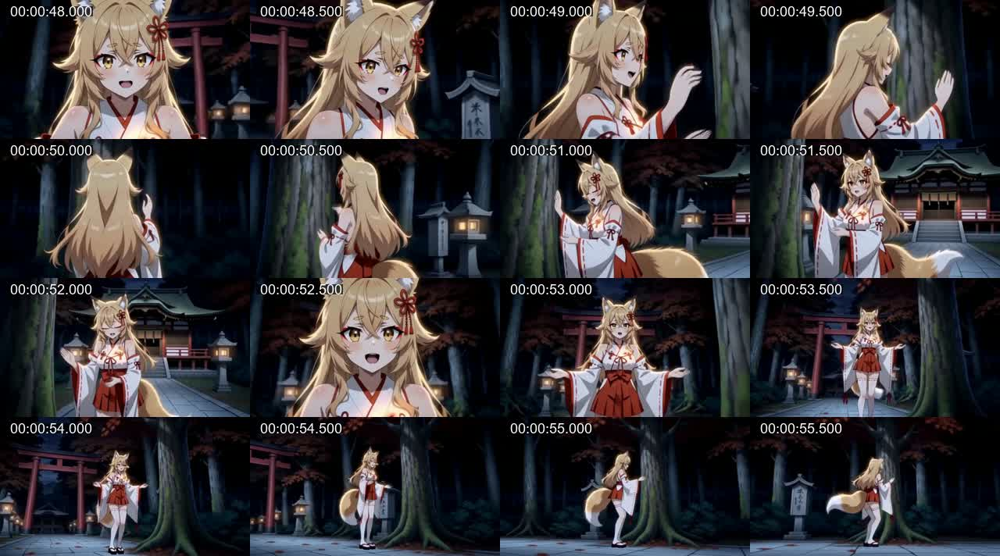
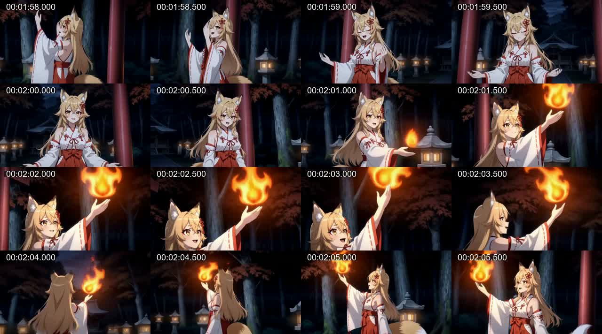
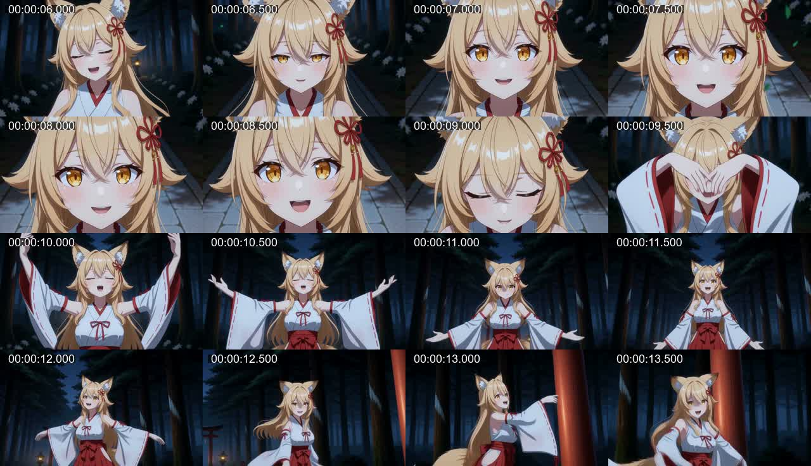

# loop-2完成動画：身体演技の反復とプロトタイプとの差

## 結論

今回の不足は、演技を指示する語数やArcの本数ではなく、**異なる感情から異なる動作を作り、その動作を途中で再開始せず、Cameraで見せ切ること**にある。
顔アップ、閉眼、御神木の出現、狐火は見える。しかし、人物の演技は手を掲げる、開く、戻すという短い循環に寄り、肩・胸・手首の語が増えても、プロトタイプのような動作の経路と勢いになっていない。

今回新しく確認した重要点は次の三つ。

1. 動画入力Planの共通Camera文に、Scene 1に相当する「暁へ手を伸ばして触れ、手を下げる」という局所動作が二回混入している。全16 Sceneへ同じ動作指示を供給してしまう。
2. 対応が強く示唆されるPlannerキャッシュでは、暁・鳥居・苔・狐火を同じ「優しく触れて離す」へ展開している。反復はAction以前のCue Cardですでに生じている。
3. プロトタイプと今回ではH3モデルとschedulerも異なる。8Bの能力差やシステムプロンプトだけを原因と断定できない。

優先順は、**コンパイル時の意味・スコープの保持 → Cueと演技フレーズの設計 → 演技を見せる尺とCamera接続 → H3設定の条件比較**とする。監査回数を増やす改修は優先しない。
この文書は分析・改善計画であり、推論処理、プロファイル、WFは変更していない。

## 対象・確認範囲

- 今回：`C:/Software/ComfyUI/output/h3_chains/mv_director_context_loop-2/final/t2v_normal_2026-09-20.mp4`
- 8B比較：`E:/OutputCollection/MiniMaxH3 Assets/千年鳥居-v1/ref2v_2026-09-12-8b.mp4`
- 27B比較：`E:/OutputCollection/MiniMaxH3 Assets/千年鳥居-v1/ref2v_2026-09-12-27b_1_gcg5.mp4`
- コード確認時点：`22178e74348e20b87d3ce6da8efbbf2ca0da7637`。

今回の動画は864×480、24fps、140.375秒、3369フレーム。
埋め込み`prompt`、`workflow`、`h3_plan`、`h3_manifest`を読み、動画内Load Text Fileのbase64を復号した。
入力名は`context_loop_plan_00002.txt`、復号した原本bytesのSHA-256は
`f1498751627f419c6cc890e705ee64aa2343e16560072ab7f9b81b8f3d7dfecb`。
同じJSONがCompilerキャッシュ`4a6967090c81ed729bc6c64049a2df5e4dcdf69c6cf10c002d0efa11aca22a2d`にも保存されている。少なくとも、動画側だけで共通文へ動作が追加された問題ではない。

元の日本語EMDファイルは今回の出力フォルダーに残っていなかった。Plannerキャッシュ
`4f5d5551d5dc1e740ac19742c804e11bc3338c369e1b6deb881fce8d5683df5f`には16 Scene・52 Shotがあり、
顔Cameraの既定変換を適用すると、全52 Camera本文が同じSceneの入力Planに完全一致する。
継続配置と多数のAction内容も一致するため対応候補として採用した。ただし、入力EMDのhashで紐付いた保存形式ではないので、厳密な翻訳前後の追跡証明とは区別する。
Directionキャッシュ二件のCamera本文には上記の暁の動作混入がない。

映像確認は、今回の全編を約4秒間隔、0–8秒・48–56秒・118–126秒を0.5秒間隔で抽出して行った。
8Bは6–14秒の0.5秒間隔、27Bは全編約6秒間隔の画像及び埋め込み指示を確認した。
実時間の全編連続再生、全フレームの関節追跡、音楽の拍検出は行っていない。以下の時刻は確認区間又はPlan境界の目安であり、加速度・拍との誤差の測定値ではない。

[根拠データ：集計、原文候補と英訳、Cue、Camera照合、Scene境界](../assets/research/loop2-performance-2026-09-20/evidence.json)

## 映像で見える差

| 区間 | 観察 | 指示との関係 |
|---|---|---|
| 今回0–8秒 | 顔へ寄り、閉眼し、顔横へ片手を上げ、引いた構図になる | 表情は改善しているが、身体の大きな経路を短く見せる設計にはなっていない |
| 今回20–29秒、苔のScene | 抽出した全編一覧では人物と参道が中心。苔への接触の対象・結果を明瞭に読み取れない | Planは「苔の上部」「触れて離す動作を繰り返し」。支持物、手の到達点、接触を見せる画角が弱い |
| 今回48–56秒、御神木 | 幹が画面に現れ、手を近づけ、前後の視点が変わる。その後は両腕を開いた姿勢へ戻る | 対象の具現化は良い。手を伸ばす動作の反復と、毎回同じ姿勢へ戻る終端が残る |
| 今回118–126秒、狐火への移行 | 炎が手のひら近くへ現れ、人物は片手を掲げたまま、Cameraと身体の見える向きが変わる | 炎は戻ったが「独立して空間を進むeffect」と「それと共存する歌唱演技」にはなっていない |
| 8Bプロトタイプ6–14秒 | 顔と閉眼から両手が顔前を通り、頭上へ上がり、左右へ開き、下がる。構図の広がりが腕の展開を見せる | 良さは開腕という終点ではなく、そこへ至る経路と、次の演技へ移る時間的なつながり |
| 27Bプロトタイプ全編の間引き確認 | 重心を落とす姿勢、左右非対称の腕、斜めに伸びる身体、根元への接触、空間を横切る炎、顔への接近が見える | Planにも支持・体重移動・袖の追従・接触結果・Cameraの経路が一緒に書かれている |

今回48秒から約8秒。左上から右へ読む。



今回118秒から約8秒。炎と手の位置関係が強く結び付く。



8Bプロトタイプ6秒から約8秒。上げた姿勢だけでなく、腕が通る途中の形と解放が見える。



図版はユーザー提供動画からの分析用抽出であり、新たに生成したイラストではない。表示時刻は抽出系列の目安。
プロトタイプにも歩行・開腕・接触の反復や不要な身体回転はある。全動作をそのまま移植することは推奨しない。

## 今回のPlanの分布

集計対象は実採用`detailed_description`の52個の`[Shot]`。
先頭の時刻を除き、最初の正式Camera Motion Typeより前をActionとして切り出した。
語の出現数は指示の偏りの指標であり、映像中の動作率や品質点ではない。

| 指標 | 今回 | 評価 |
|---|---:|---|
| H3 Scene / 内部Shot | 16 / 52 | H3の生成単位と、その中の編集・演技指示を区別する |
| 初回を含む非継続 / 継続 | 4 / 12 | 継続自体は存在。非継続はScene 1・7・10・12 |
| Arc Shot | 15 / 52 | Arcの存在不足だけでは説明できない |
| 内部Shotの平均 / 中央値 | 約2.70 / 2.48秒 | 52中27 Shotが2.5秒未満。演技と画角を頻繁に再指定している |
| Actionにshoulder又はchest | 34 / 52 | 肩・胸への偏り。身体の語を追加するだけでは多様化しなかった |
| Actionにwrist | 11 / 52 | 手首の記述はあるが軌道・演技意図が似ている |
| Actionにgentl / lightly / slightly / slowly | 34 / 52 | Cameraはfastでも、人物には穏やかな小動作が多い |
| Actionにrepeat | 4 / 52 | 反復を禁止する共通方針に対し、局所文が反復を指示する |
| Action完全一致 | 3種類が各2回 | 類似した意味の反復はこの件数に含めない |
| 共通prefix | 13,344文字 | 8B比較は7,122文字。約1.87倍 |
| 各Sceneの最終prompt | 19,316–20,811文字 | 共通文と識別・制御文の占める量が大きい |

8Bプロトタイプは13 Scene・21内部Shot、27Bは13 Scene・29内部Shot。
全尺を単純に割ると約6.62秒、約4.79秒で、今回より一つの指示へ使う尺が長い。
同じ区間を分割した対照実験ではないため、これだけで最適尺を決めない。

## 原因の切り分け

### 1. 共通文に局所Actionが混入し、翻訳段階の意味保持にも問題がある

今回の入力JSONの`prompt_prefix[12]`はCamera一般方針だが、末尾が次のようになる。

```text
... different terminal silhouettes.Zoom In Begin with a light forward tilt of the shoulders and lift the chest.
Extend the hand toward the upper part of the dawn and gently touch it with the palm.
Have the person gently touch and then release with the palm. Lower the hands and slightly lower the gaze.
Tracking Shot Shoulder lightly forward tilt, lift the chest. Extend the hand toward the upper part of the dawn ...
```

この暁の接触と手を下げる動作が全Sceneへ入る。反復への影響度は未測定だが、スコープの誤りは確実。
同じ入力のScene 1 Shot 1は`Lower the hands and slightly lower the gaze.`。
対応候補の日本語Actionは「肩を軽く前傾させ、胸郭を押し上げる」であり、Shot 4の文がShot 1にも入ったように見える。
Scene 4の「契りの場所」が`chest area of the contract`になるなど、英語判定を通っても意味が保たれていない例がある。

現在の[EMD renderer](../../core/planner/renderer.py)は共通文へDirectionを出す。[Compiler](../../core/compiler/ref2va.py)は共通文とScene本文の翻訳fragmentを同じ列へ集める。
[保護処理](../../core/compiler/protection.py)はCamera語を翻訳入力から分離してから復元するため、Camera一般論は短い日本語fragmentに分かれやすい。
同じ翻訳batchに異なるスコープの断片が入ること、短い断片の意味が不明瞭になることは混入の候補原因。
ただしraw翻訳応答と入力EMDの厳密な対応ログが残っていないため、特定の関数のindex誤り又はLLMのslot取り違えまで断定しない。

最初に翻訳の入力元field・fragment番号・原文hash・採用英訳を追えるようにし、今回の末尾とScene 1を小さい再現fixtureにする必要がある。
原文から異なる動作へ変わる翻訳はAS IS原則によって許容されるものではない。

### 2. Cueの具体化が、対象を替えた接触テンプレートになっている

対応候補キャッシュのCueでは、Scene 1・2・3に以下が共通する。

- 可視展開：`人物が手のひらで優しく触れて離す`
- 身体主導：`肩を軽く前傾させ、胸郭を押し上げる`
- 終端：`手を下げ、目線をやや下げる`

対象だけが暁・鳥居・苔へ変わり、配置も「対象の上部」になる。Scene 7・9も同じ接触へ寄る。
暁を触れる物体にする、狐火を身体操作にする、鳥居をくぐる歌詞から上部に立つ動作へ進む、といった誤りはこの上流から発生している。
Scene 5には「対象=増えてゆく」「胸の古傷が光る」、Scene 8には「一瞬の場所」があり、対象抽出と物性判断も不十分。

[bounded Beat prompt](../../prompts/timeline_planner_visual_beats_bounded_system_prompt.txt)とMotionは、接触時の安全な動作として「手のひら又は指先で優しく触れて離す」を提示している。
今回のCueはこの例に非常に近い。因果を単独実験したわけではないが、以前のP0試験でも具体例をコピーした事実と整合する。
禁止文や身体部位の列挙を増やす方法は、8Bへ次の共通テンプレートを与えてしまう可能性が高い。

歌詞対象の出来事と歌唱者の演技は別に成立させる必要がある。苔は接触の固有対象、狐火は自律した現象、抽象的な感情は人物の態度として扱い、全てを手の動作へ変換しない。

### 3. 「振付をShotへ分配する」という指示はあるが、分配を保持する仕組みが弱い

[dance_phrase Action prompt](../../prompts/timeline_planner_actions_dance_phrase_system_prompt.txt)には、準備・アクセント・解放の分配がすでに書かれている。
したがって同じ一文を強調して追記するだけでは、今回までの改修を繰り返すことになる。

現行[engine](../../core/planner/engine.py)はbounded生成時に`recent_action_history`と`previous_batch_action`等を送信前に除く。
`previous_shot`には番号があるが、前Shotの終了姿勢は入っていない。履歴の模倣防止には意味がある一方、継続すべき短い身体状態まで受け渡せない。
Scene内の各slotは同じCueの身体主導と終端を共有し、対象のphaseはあるが、身体のどの進行部分を撮るかは曖昧。
その結果、Scene 10の先頭二つが同文、Scene 14・15は胸を押し出す・肩を回す文の反復になっている。

肩や胸を動かすこと自体は問題ではない。感情の意図、左右非対称の腕の経路、肘の位置、手の到達点、短い停止、表情の変化が一つの順序として読めることが必要。
人物の全身スピンは追加せず、上半身の変化と自然な支持・重心移動だけでも表現できる。

### 4. Cameraは演技を受け取るが、前後とつながらず、見せる部位も競合する

今回のArc方向は非継続で区切ると、Scene 2–6、7–9、10–11が右、12–15が左で揃っている。
前回修正の方向保持はPlan上で確認できる。ただし実映像の全区間で角速度が連続することを証明するものではない。

残る問題は方向以外の接続。

- Scene 9：Arcはmediumで終わるが、次のPush Inはwideから始まる。その次のArcはrear three-quarterから再開始する。
- Scene 7 Shot 2：鳥居へ手で触れる局面を顔Zoomで撮る。手と接触結果を見せにくい。
- Scene 12 Shot 1：木の表面をなぞる動作に顔Zoom。演技が見える構図と割り当てが合わない。
- Scene 7 Shot 1：後方の開始視点から正面顔へ向かうArcに「両目・口を見せる」条件もある。経路中に成立する範囲が曖昧。

現在の七fieldのCamera契約には、演技のアクセント時点を参照する場所がない。
開始と終了の構図を独立して選ぶだけでは、「手が収まってから顔へ寄る」という同期を保持できない。

### 5. H3向け共通文にPlanner向けの配分規則が多い

実際のprefixは「適格Shotの概ね半数」「Camera文をどう書く」「Actionを変更しない」など、計画作成者への指示を大量に含む。
動画モデルに必要なのは、そのSceneで確定した出来事・演技・Camera・外観である。
この混在と13,344文字の長さは整理候補だが、文字数から注意配分や無視率は測れない。
ローカルのH3 tokenizer経路からも、今回の文字数だけを理由に末尾が切り捨てられたとする根拠は得られなかった。

### 6. 生成条件が同一ではない

| 保存WFの条件 | 今回 | 8B / 27Bプロトタイプ |
|---|---|---|
| UNETLoader | `minimax_h3_ref2va_pruned_int8_convrot.safetensors` | `minimax_h3_fl2va_pruned_int8_convrot.safetensors` |
| BasicScheduler | `simple` | `beta` |
| step数 | 8 | 8 |
| TurboLoRA / strength | `minimax_h3_ref2v_turbo_4step_v0.1_comfyui_bf16.safetensors` / 1 | 同じ保存値 |
| Sigma Shiftのwidget値 | 12 / 3 | 同じ保存値 |
| 出力解像度 | 864×480 | 1280×736 |
| 参照 | 人物と背景を分離した現在の構成 | 過去の参照構成 |
| 音源fingerprint | 今回の値 | 今回と異なる値 |

これは動画埋め込みWFの設定比較であり、現在のディスク上にあるモデルファイルのhash同一性を保証するものではない。
27B動画のPlanner保存名は`Qwen3.8-27B-heretic-ara.Q5_K_M.gguf`、8Bは`qwen3-8b-abliterated-Q4_K_M.gguf`。
今回の動画は分離後の動画WFなので、Planner実行時のモデルfingerprintまでは含まれていない。

`fl2va`へ戻せば解決する、`beta`が優れている、と判断する材料はまだない。
ただし「同じ8Bだからプロンプトだけ直せば以前と同じ映像になる」という比較の前提には、これらの差が残る。

## 評価方法と次の実装範囲

最初の実装範囲はP0と、P1のうちCueに固定接触・固定身体始動を作らせない入力整理までを推奨する。
以前のP0は「身体演技を増やす指示を追加する」実装だった。今回は、出典の混入を解消し、フレーズを各slotへ分配する入力構造を変える点が違う。

Scene Debug Splitterで次の区間を比較する。中途Sceneを切り出すと継続文脈を失うため、必要なら直前Sceneを含める。

| ケース | 合格の観点 |
|---|---|
| Scene 1と10、具体物に依存しない歌唱 | 始動と腕の経路が異なり、同じ肩・胸・手戻しを再演しない。全身スピンを増やさない |
| Scene 3、苔 | 自然な支持物と到達点があり、一度の接触とその反応が読める。足で踏まない |
| Scene 6、御神木 | 良好な心象・出現を残し、手を伸ばす動作を何度も再開しない |
| Scene 9・14、狐火 | 身体操作が指定されない限り炎は自律して空間を進み、歌唱演技と共存する |
| Scene 7・12、顔への移行 | 接触・腕の動作を先に見せ、目・眉・口を収める顔の短い反応へつなぐ |

Plan評価では原文→英訳の対応、局所出来事のスコープ、演技順序、Cameraの開始・終了整合を確認する。
映像評価では「部位名がある」ではなく、手の経路、左右の違い、溜めとアクセント、終端の変化、Cameraが動作を隠していないことを確認する。
初回は同一seedの短い比較、改善案を残す前に別seedでも確認する。全曲再生成はその後とする。

call数・入力token・出力token・処理時間も記録し、追加の10回監査や毎Shotの別LLM審査を常用しない。
構文違反は既存の有限回復で扱い、演技品質だけを理由に全曲を延々と停止・再試行させない。
今回GPU推論・動画の再生成は実施していないため、改善案の効果と5060での実行時間は未検証。

## 関連

- [前回v57：接触・上半身演技・Arc方向](planner-v57-loop10-contact-camera-review-2026-09-20.md)
- [P0実装と8B比較：身体演技の部分回復と反復](planner-p0-dance-phrase-2026-09-20.md)
- [身体演技とCamera同期の初回分析](anime-emotional-mv-performance-camera-review-2026-09-20.md)
- [8Bと27Bの創作差分](prototype-8b-creative-regression-analysis-2026-09-20.md)
