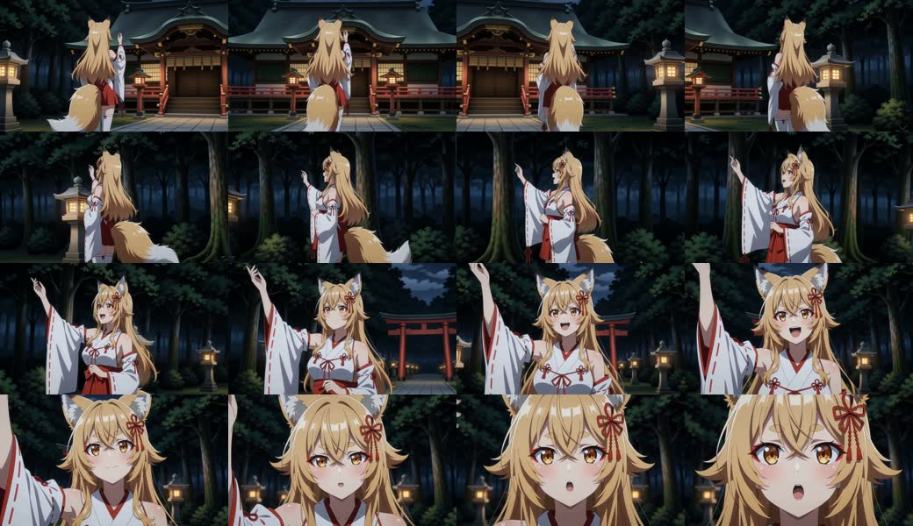
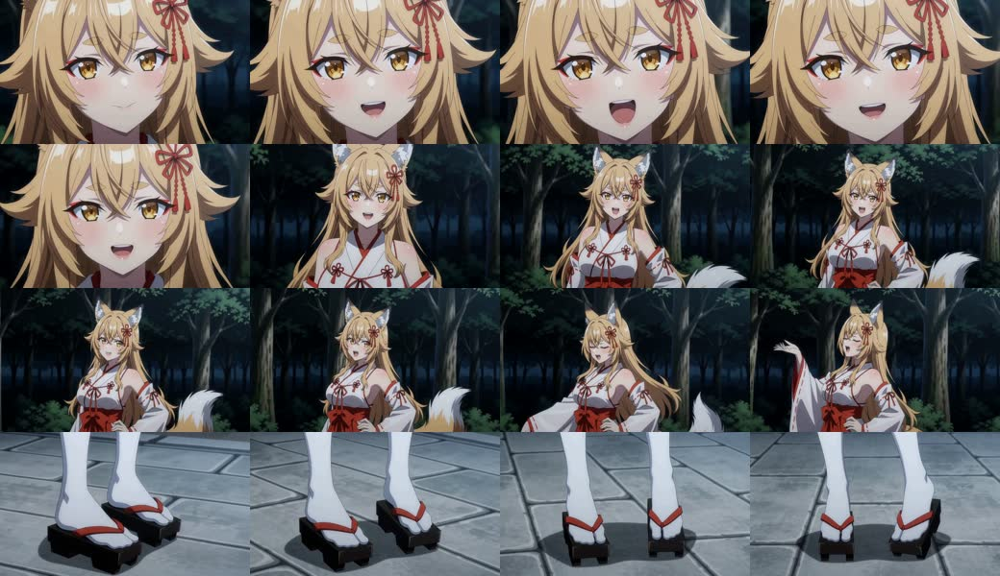
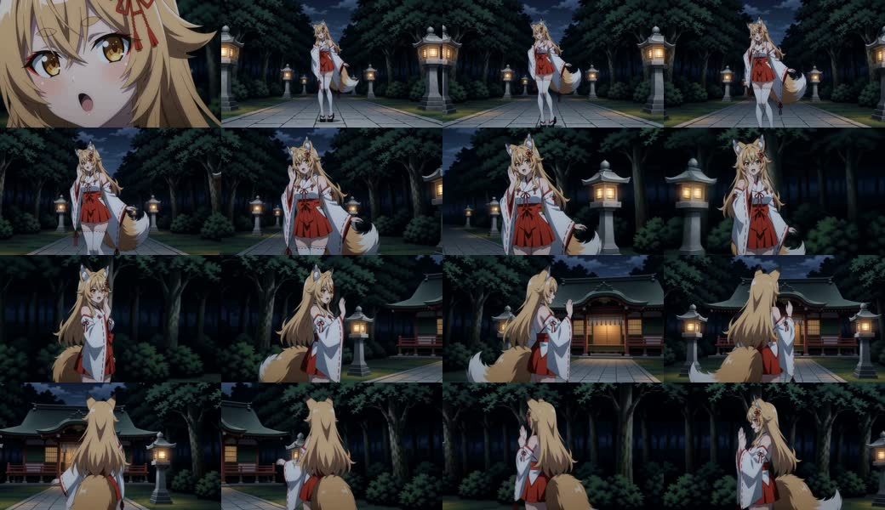

# 新曲の身体振付不足：EMDと完成動画の照合

作成日: 2026-09-22
対象: `C:/Software/ComfyUI/output/mv_director/context_loop_emd_00001.md`、同番号の`context_loop_plan_00001.txt`、`C:/Software/ComfyUI/output/h3_chains/mv_director_context_loop/final/t2v_normal_2026-09-22.mp4`
判定: 身体振付不足は少なくともPlannerのAction出力時点で存在する。H3だけを主因とはできない。

## 観察方法と範囲

完成動画は1280×736、24 fps、176.917秒。4秒間隔の全編サムネイルと、28–36秒、84–92秒、124–132秒を0.5秒間隔で抽出して目視した。これらは動画全フレームの精査ではない。対応EMDの22 Scene・36 Shotとコンパイル済みPlanを照合した。Planner実行ログ、採用前候補、Cue Card及び監査verdictは保存物に含まれないため、個別候補がどう選ばれたかまでは断定しない。

全編の粗い時系列確認用: [前半](../assets/research/new-song-motion-review-2026-09-22/overview-01.jpg) / [後半](../assets/research/new-song-motion-review-2026-09-22/overview-02.jpg)。コンタクトシートは左上から右へ、次の行へ進む。

## 主な所見

1. **振付の欠落はEMDに既にある。** 36 Action中、「手」を含むものは31、「胸」は24、「肩」は16。「脚」「膝」「重心」「踏み」を含むActionは各0、「歩」は1。「ゆっくり」は9、「軽く」は13。語の出現数は動作品質そのものの点数ではないが、指示の身体部位と速度が上半身の小さな変化へ偏っていることを示す。歌詞で選ばれた対象への反応はある一方、支持脚から骨盤・体幹・両腕へ伝わるフレーズが具体的なActionとしてほぼ書かれていない。
2. **28–36秒はカメラが主に動く。** EMDのScene 4は「右手をゆっくり上げる」「さらに上げる」の二段階で、足場と体幹の転換・腕の終端の対比がない。Planも`raise the right hand slowly`、`slowly raised even higher`と翻訳している。連続フレームでは腕が上がる一方、胴体はほぼ一定で、ArcとPush Inによる画角変化が映像の勢いを担う。これはH3が豊かな振付を無視した例ではない。
3. **サビでも近い身体テンプレートが戻る。** 01:25.833の「右肩を右へ／胸を左へ／手を腰」、01:40.000の「左肩を左へ／胸を右へ／手を腰」は左右を反転した同種の演技。01:35.750も腰に手を置いたまま肩・胸を揺らす。84–92秒の連続フレームでは顔のリップシンクとカメラの引きが目立ち、人物の支持脚・骨盤・胴体は大きく変わらない。末尾には足元だけの構図も入り、振付の発展には結び付いていない。
4. **Actionの完全重複が残る。** Scene 16の02:00.750／02:05.333は同じ「肩を右へ傾け、胸を左へ動かし、右手を顔の前で軽く触れる」。Scene 6と21にも隣接Shotの完全重複がある。計3組、6 Shot。124–132秒の動画でも人物がほぼ直立したままカメラが回り、二段階の身体フレーズは読み取れない。コンパイル済みPlanにも同じ肩・胸・手のActionが二Shotへ残っており、Compilerが振付を削った結果ではない。
5. **撮影の動きは豊富だが、被写体の動きとは別。** EMDの36 Camera中、Arc Shotは19、Truck Rightは6、Zoom Inは6、Push Inは3、Pedestal Upは2。動画でも顔アップ、横移動、背面への回り込みは見える。反面、Cameraに対しActionが「軽く揺らす」「上げたまま保つ」「静止する」だと、画面は動いても人物の演技は静的になる。

## 実装から見た原因候補（優先順）

### P0: Motion modeがShotの役割を上半身へ狭める

`core/planner/engine.py`の`_performance_role`は、単一Shot Sceneへ`lyric_driven_full_body_performance`、複数Shotにも`continuity_transformation`や`expressive_hand_arm_performance`等の異なる役割を割り当てる。しかし`performance_mode=dance_phrase`の処理では、顔Shot以外の役割を一律`continuous_upper_body_phrase`へ上書きする（現行の3924–3925行付近）。元の役割の多様性がAction LLMへ届かない。今回のEMDで脚・重心が0件となった事実と強く整合するが、他の要因もあり得る。

### P1: Promptの希望はあるが、監査の合格条件にはなっていない

`prompts/timeline_planner_actions_dance_phrase_system_prompt.txt`には、強い場面で通常Shotの少なくとも一つに踏み替え・膝の弾み・重心移動を含める指示がある。一方、`prompts/timeline_planner_action_audit_system_prompt.txt`は「上半身のフレーズだけでも完全な演技」「より劇的になり得るという理由だけではrejectしない」と明記する。`_action_budget_violations`は遅い語をbatch内およそ4分の1まで許し、単純な手の上下を検査するが、Scene単位で支持脚→骨盤→上体のフレーズが一度もないことは検査しない。なお`軽く`は現在の`_SLOW_ACTION_RE`対象外。したがって、要求と受入条件の間に隙間がある。

### P2: Scene-spineは全Sceneの身体振付計画ではない

`scene-spine`は`dance_phrase`でも、複数Shotかつ有効な具体対象CueのあるSceneだけ実行する。歌詞が抽象的な感情を歌うScene、単一Shot Sceneでは従来のCueと`performance_phase`に戻る。これは一回の対象イベントをつなぐには有効だが、曲全体の踊りや身体フレーズを保証する構造ではない。今回どのSceneで採用・fallbackしたかはPlannerログがないため未判定。

### P3: H3の動作再現も別途検証が必要

EMDにない重心移動をH3へ期待できない一方、EMDにある手・肩の小動作すら動画で弱い区間はある。参照画像、リップシンク、尺、モデル、seedによる追従率は同一Actionを固定した短区間比較なしには切り分けられない。今回の主要な修正順はH3設定より前のAction設計である。

## 最小の改善・検証計画

1. **まず非顔Shotのrole一律上書きを外す。** `performance_phase`と`dance_phrase`自体は保ち、既存`_performance_role`の多様な値をActionへ届ける。新しいLLM task、JSON/EMD形式、PythonによるAction本文の後編集は不要。実装対象は後続指示により`anime_emotional_mv`を開発用とし、`anime_story_mv`を比較用基準として保持する。共通Python変更が両profileへ波及しないよう明示的なopt-inを設ける。
2. **高エネルギー場面へ疎な身体accentを割り当てる。** P0だけで不足するなら、サビ等の一Sceneに最大一つの通常Shotを「支持脚・骨盤・体幹・腕がつながる身体phrase」候補とする。顔Shotや対象の一回イベントへ重ねず、同じ足運びを全Sceneに強制しない。Action本文はLLMが生成しAS ISで採用する。既存の監査へ「役割に対する身体動作が欠ける」を追加する場合も、失敗で全曲を停止させず、警告・限定再要求から始める。
3. **EMDで先に合格判定する。** 今回と同じ22 Scene・歌詞で、低コストのPlanner再実行から「下半身・重心を含む明確な身体phraseを持つScene数」「上げ下げ・肩胸テンプレートの反復」「完全重複Action組数」を比較する。具体的な足指や履物の接写が増えないことも確認する。改善しなければ全編H3は回さない。
4. **動画は3区間で比較する。** EMDが改善した場合だけ、28–36秒、84–92秒、124–132秒を同じモデル・seed・参照・ステップ数で短区間生成し、人物の支持脚、骨盤、胴体、左右の腕の終端差が見えるか比べる。ここでActionは十分だがH3が追従しないと判明したら、render prompt、Shot尺、参照拘束又はリップシンクとの競合を次に調べる。

この文書は当初の調査記録である。その後のP0–P3実装・再推論結果は[検証レポート](new-song-motion-p0-p3-verification-2026-09-22.md)に記録した。
