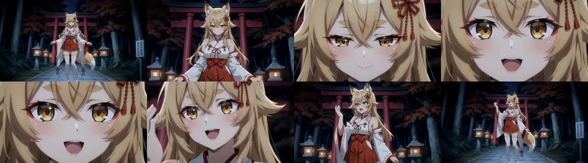
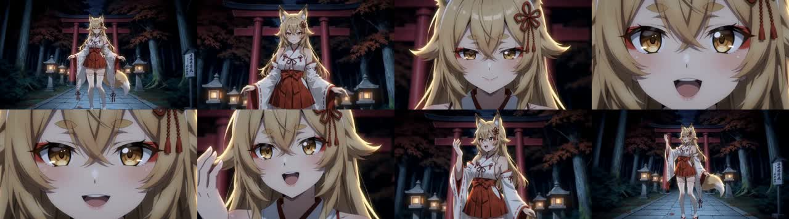

# Planner v60：loop-2のP0〜P3実装と短区間検証

## 結論

共通文と局所Actionの翻訳を分離し、プロファイルの計画用本文を動画用本文から分けた。
演技phaseと前Cueの終了状態をActionへ渡し、内部Shotを長めに保つ候補選択と、有限Cameraの開始・終了構図の接続を実装した。

**基盤の修正は確認できたが、プロトタイプ同等の身体演技を回復したとは判定しない。**
実8Bでは抽象語を物体とする誤認、肩の前傾、手の上下が残った。
H3の一Scene比較でも、共通文短縮やscheduler変更だけによる大幅な演技改善は認められない。

先行する舞台固有語の修正は `c6e1528` としてorigin/githubへpush済み。
本レポートのP0〜P3は、その後の改修・実験である。

## P0：共通文の混入を切り離す

- Compilerは一つのEMD field内だけで翻訳する。別Subject・共通文・別Shotのfragmentを同じ翻訳呼出しへ入れない。
- INFOにfield ID、source SHA-256、fragment数、完了文字数を残す。
- 成功キャッシュの `translation_trace` に原文、fragment位置、採用英訳、復元文を保存する。
- Motion/Camera profileへ任意 `render_prompt` を追加。詳細な本文はPlannerへ渡し、EMDでは完全一致したprofile所有項目だけを作者が定義した描画用本文へ投影する。
- 作者の追加文やLLM採用Actionは要約・修復しない。未指定profileは従来どおり。
- Plannerはv60、Compilerキャッシュはv16。以前の保存Plan JSONが自動更新されるわけではない。

これで共通CameraとScene 1 Actionを翻訳LLMへ同居させる入口はなくなる。
ただし旧出力の生の翻訳応答がないため、「どのslotがどのslotをコピーしたか」は遡及的に断定しない。
英訳自体の意味的誤りを完全に検出・修復するものでもない。field分離による呼出回数増加は実測対象とする。

## P1：一つの演技を分配する

`dance_phrase`のみで、既存Cueの `身体主導` / `終端` を使用する。
新しいLLM taskや監査段階は増やしていない。

- 一Shotなら `complete_phrase`、先頭は `prepare_and_accent`、末尾は `release_and_reaction` として進行を明示。
- 同Scene内では前slotの出力から先へ進むよう指示。
- 継続Scene先頭へ前Cueの終了状態を `entry_body_state` として渡す。
- 肩→胸郭→腕という固定の始動順と、どの対象にも同じ「触れて離す」完成例を誘導する文を整理。

`entry_body_state`は**計画されたCueの終端**であり、採用Actionや生成動画から検出した実姿勢ではない。
今回の三Scene診断は全SceneがCUTになったため、Scene跨ぎの状態引継ぎの映像効果は実証していない。

### 残った問題

短い診断歌詞「昨日の願いが苔に還る」をDiscoveryが `motif|願い` と選択した。
後段はその対象を引き継ぎ、「願いが空を漂う」演出を作った。苔という語を追加で機械挿入しても解決しない。
「この想いをあなたへ届けたい」でも想いを接触可能な対象として扱い、不自然な配置や括弧書きが残った。

つまり、演技の分配だけでなく**Cueを選ぶ前の意味分類**が依然ボトルネックである。
今回の改修はこの誤りを辞書・文字列置換で隠していない。
肩の前傾と手の上下も残り、P1の創作品質は未達と判断する。

## P2：演技の時間とCamera接続

- `dance_phrase`の通常内部境界候補は4秒以上の間隔にする。短いSceneも一Shotで扱い、H3 Scene境界・音声区間は変えない。
- 三Scene診断では計6 Shot、各約5秒となった。実時間の音楽beat解析は追加していない。
- Cameraへ前Cameraの終了画角・視点と、同batch内の直前slotを渡す。
- emotionalのPython所有・有限Camera契約で、継続グループの開始画角・視点を前の終端へ接続する。
- 背面・側面から顔正面へ単純Zoomする幾何矛盾は、同方向のArcで顔へ入る接続として扱う。
- 接触や腕のアクセントを見せてから顔の反応へ移るよう、Camera LLMへ指示する。

これは既存の有限Camera構造処理の拡張であり、Action自然文を修正するものではない。
自由文Cameraに適用しない。幾何上の接続を優先する場合、Arc配分の目安より連続性を優先する。
角速度・実際の関節軌道・描画された手の可視性まで保証する契約ではない。

seed 2の診断では、顔終端→顔からのArc、側面の上半身終端→同じ側面・上半身からのArcが確認できた。
一方、対象の描写と演技の意味が弱いため、Camera接続だけで説得力は回復しない。
この新P1/P2全体を元の全曲へ適用した動画比較は、今回のP3比較には含めていない。

## 実8B診断

モデルは運用WFと同じ `Qwen3-8B-Abliterated/qwen3-8b-abliterated-Q4_K_M.gguf`。
RTX 5090で、3 Sceneの合成診断入力を使用した。元の全曲の再実行ではない。
`n_ctx=16384`、`max_tokens=4096`、temperature 0.2、n_batch 512。
運用WFのtemperature 0.1 / n_batch 256とは異なるため、その実行時間へ直接外挿しない。

| 試行 | 完了 | モデルload込みPlannerまで | 翻訳込み全体 | Planner呼出し | 翻訳batch |
|---|---|---:|---:|---:|---:|
| seed 1、P2接続前の途中版 | 成功 | 37.54秒 | 39.89秒 | 29 | 10 |
| seed 2、最終P1/P2 | 成功 | 37.45秒 | 39.81秒 | 28 | 10 |

二試行の間にプロファイルとCamera接続を変更しており、厳密なseedだけのA/Bではない。
両試行で各Sceneの監査は2回、全6回。監査上限を増やしていない。
成功はプロトコルとコンパイルの完了を指し、演技品質の合格ではない。
生の入力・応答・EMD・Plan・translation_traceは以下の診断出力へ保存した。

- `C:\Users\owner\AppData\Local\Temp\mvd-performance-v60-seed1\`
- `C:\Users\owner\AppData\Local\Temp\mvd-performance-v60-seed2\`
- 再実行用：[validate_performance_phrase.py](../../tools/validate_performance_phrase.py)

## P3：一SceneのH3比較

元loop-2動画から保存したAPI graphを使用し、Scene Debug SplitterでScene 1だけを出力した。
今回の三本間で参照画像・音源・局所Action・局所Camera・seedを固定した。
参照ファイルは現在ディスク上のファイルであり、過去動画生成時とファイル内容が同一であることまでは保証しない。

- 864×480、24fps、226フレーム、9.416667秒
- seed `3635910561731543279`、steps 8、ref2vaモデル
- Turbo LoRA strength 1、video/audio shift 12/3
- `ref_image_size=max`、同じ人物・背景画像と元のボーカル／ミックス
- 通常WFを変更せず、ローカルポート8191の一時ComfyUI、別出力先／run名で実行

| ケース | 差分 | 観察 |
|---|---|---|
| A original/simple | 元の共通文・simple | 顔へ寄り、片手を上げてから引く |
| B short/simple | Motion/Camera共通文だけ短縮 | 同じ大筋。手と顔の細部は変わるが、新しい演技フレーズは生まれない |
| C short/beta | Bからschedulerだけbetaへ | 大筋はBと同様。明確に優れるとは判断できない |

Bの共通Motionは4,644→356文字、Cameraは4,963→421文字。
二項目計9,607→777文字。ほかのprefix項目、局所Action/Cameraは固定した。
この比較にはP1/P2の新しいAction/Camera生成結果を混ぜていない。

以下は各動画から1秒間隔で抽出した最初の8フレーム。時間順の構図・ポーズ比較であり、
この静止画だけから全フレームの滑らかさや角速度を保証するものではない。

### A：元の共通文 / simple

### B：短縮共通文 / simple

### C：短縮共通文 / beta

### 保存先と識別

出力root：`C:\Users\owner\AppData\Local\Temp\mvd-performance-h3\h3_chains\`

| ケース/run名 | 動画SHA-256 |
|---|---|
| `mvd_p3_original_simple` | `ba6f89a76e0165c597424ead194ca69de84272513723049a7058f25f228a7909` |
| `mvd_p3_short_simple` | `e8411555b9a95784483bc5da685204e26fcd279ad76d3282a7a51867bb7414bc` |
| `mvd_p3_short_beta` | `16d1da84ef383d4f2f4b983102a2d1057af2235de3ea6d2ba593102f315288a3` |

各runの `final/<run名>.mp4` が完成動画。比較Planと送信APIは
`C:\Users\owner\AppData\Local\Temp\mvd-p3\` に保存した。
[共通文比較fixture生成](../../tools/prepare_loop2_prefix_comparison.py) /
[一Scene送信ツール](../../tools/submit_h3_debug_case.py)。
これらは検証ツールで、通常生成経路に文章の置換処理を追加するものではない。

H3側でaudio末尾不足6,666 samplesを無音補完したWARNINGが出た。全ケースが同じ経路で完了したが、
リップシンク精度の比較は今回の評価対象にしていない。
`fl2va`モデルへの変更や、解像度変更、別seed動画の比較は実施していない。
今回の結果ではscheduler既定値を変更せず、simpleを維持する。

## テスト・終了処理・次の優先順位

全418テスト成功。追加した回帰試験は翻訳field分離、出典hash、作者文の保持、
render metadata、4秒候補と短Scene、Camera構図継承・不可能なZoom・Static構造を対象とする。

検証キューが空であることを確認しモデルを解放、一時起動したComfyUIプロセスだけを終了した。
終了時の5090はGPU使用率0%、VRAM 1,643MiB。元動画・入力アセット・通常WFは上書きしていない。
この環境の数字は5060の性能・VRAM使用量の証明ではない。

次に優先するのは以下。新たな全曲監査や10回retryへは拡大しない。

1. **Discovery単体の意味評価。** 抽象語と、それが向かう具象対象を取り違えるケースを小さな歌詞セットで比較する。
2. **Cueの終端ではなく採用Actionの終端をどう低コストに扱うか。** 同じ完結動作の再開を避ける。新field追加はコストと効果を先に比較する。
3. **具体的な演技が成立したActionで再び短区間レンダリング。** 現状の弱いActionにCameraやschedulerだけを変えても、プロトタイプの演技は再現しない。

## 追記：翻訳トレースのキャッシュ保存不備

実運用で`translation_trace[].translated contains non-JSON value tuple`が発生した。
翻訳は終了していたが、`translate_exact`のtupleをそのまま記録し、厳密なキャッシュ用JSON検証が拒否していた。
上記のGPU診断は通常の`json.dumps`で証跡を保存しており、tupleを許容するため本番の保存境界を検証できていなかった。

トレース記録時に、schema上の配列三項目をlistへ変換するよう修正した。原文・英訳・順序は変更せず、
共通JSON検証を緩和する対処は行っていない。実ノードの日本語翻訳から`SuccessCache.put_success`、
保存内容の読み出し、再推論せずcache hitになるところまで、`reuse`と`refresh`で回帰確認した。
このテストは修正前に報告と同じエラーを再現し、修正後に成功した。全419テスト成功。
診断ツールにも同じ厳密なキャッシュ保存処理を追加した。この追記の検証にGPU推論は必要ない。
