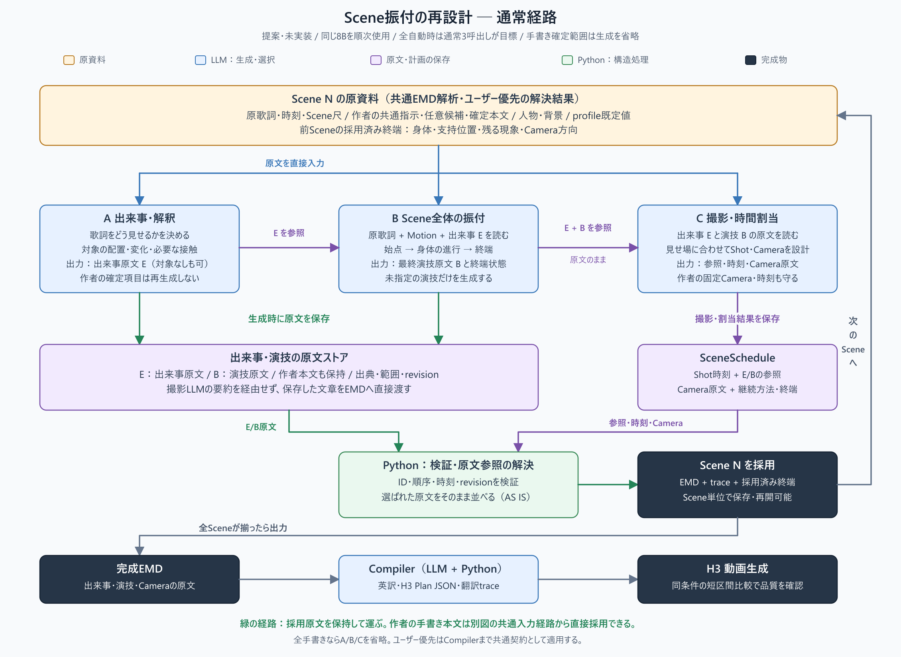
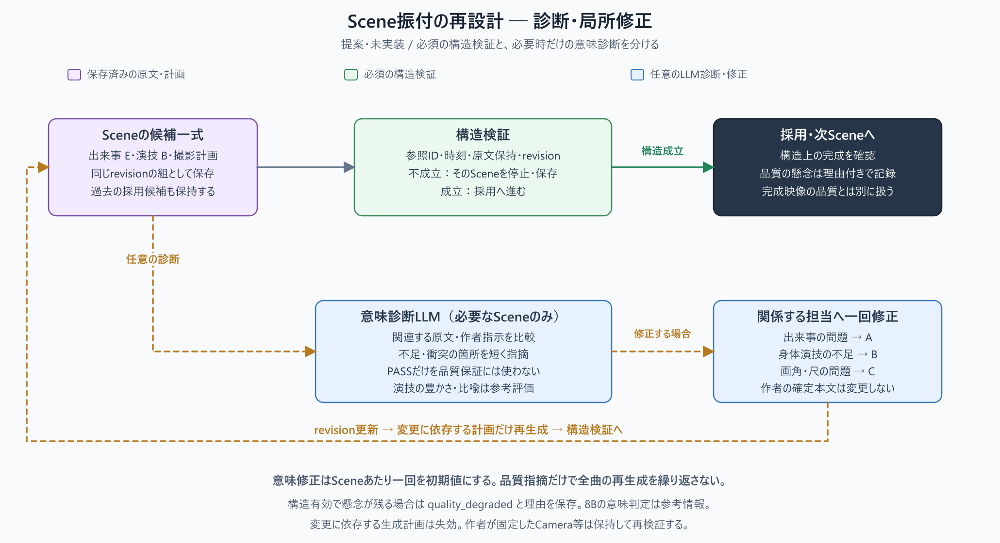
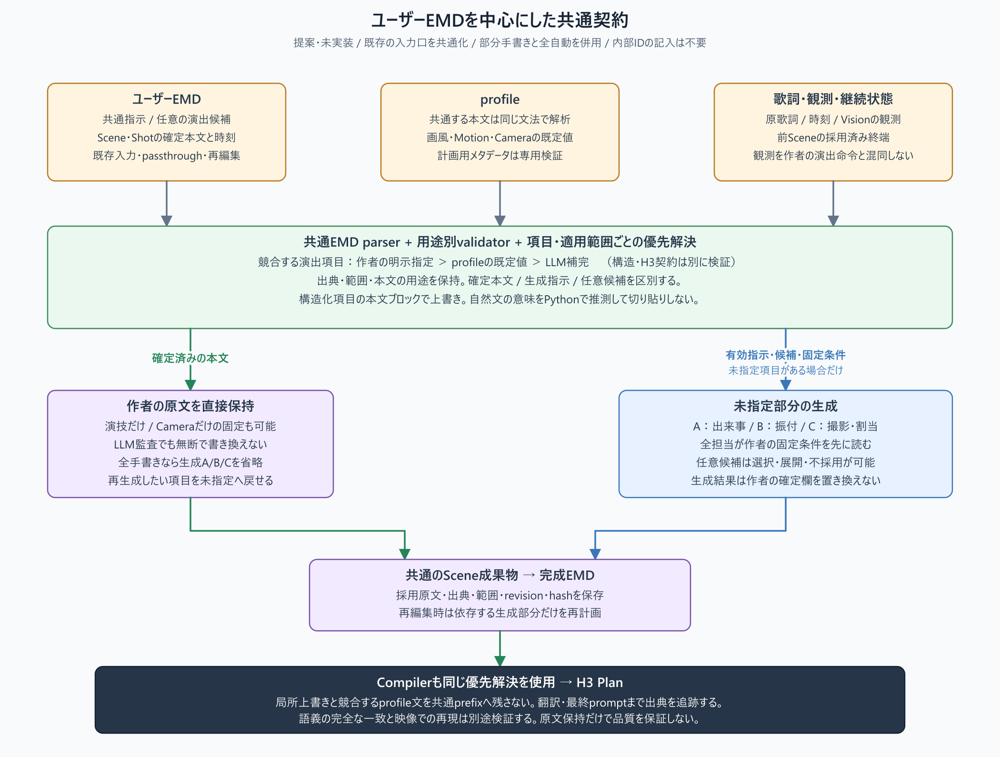

# 8B振付生成の再設計：Scene単位の原文保持と短い統合経路

2026-09-23。分析対象は `dev` の `b548322` と、未コミットのScene身体フレーズ実験。**設計提案であり、本報告ではPlannerの実装、プロファイル、ワークフロー、ブランチを変更していない。** GPUによる追加推論・動画生成も行わず、保存済みの応答と実装を再調査した。

追記：この段落は設計時点の記録である。その後のオプトイン実装と実8B第一次試験は
[実行結果](scene-author-pilot-2026-09-23.md)へ分離した。初回8Bでは形式は成立したが、
振付と歌詞対象の出現時刻は採用基準を満たさず、現行既定経路は置き換えていない。

## 結論

推奨するのは、**振付担当のLLMがScene全体の最終演技文を書き、その原文を後段で再作文せず、撮影計画が参照してEMDへ運ぶ構成**である。歌詞の出来事、人物の演技、撮影を専門の短い要求へ分けつつ、同じ身体の文章を何度もLLMに書き直させる経路を減らす。

ユーザーの「経路が深く、情報が欠落する」という仮説には根拠がある。ただし今回確認した問題は、後段での省略だけではない。**必要な身体演技が最初から生成されないこと、身体より対象描写を優先する契約、生成前の画角・Shot割当、採用前の古い状態を次Sceneへ渡すこと**も重なっている。Pythonの関数呼出しが多いだけで意味が失われるわけではなく、内容の再生成、入力の選別、役割の強制、候補の採用境界を調べる必要がある。

LLMの段数を増やすこと自体は否定しない。旧8Bにも先行の動作設計があった。問題は**専門段階の成果が最終出力の原文になるか、次のLLMに捨てられ得る参考情報で終わるか**である。監査を増やすだけでは振付は生まれず、8Bによる監査の誤判定と再試行費も増える。

次期構成は通常三つのScene内呼出しを目安にする。

1. Sceneの解釈と対象の出来事を決める。
2. 振付担当が人物の時間順の演技を、最終出力用の原文として書く。
3. 撮影担当がその原文と出来事を読み、内部Shotへの割当、画角、Cameraの動くタイミングを決める。

現在の諸段階へ三段を追加する案ではない。Cue、Scene Spine、Action、Layout、Cameraの責務を置き換え、通常の意味監査は必須経路から外す。実装前に、Scene全体を一回で書く簡単な案も対照実験に入れ、三段化が必要かを確認する。

**ユーザーEMDをこの構成の外付け例外にしない。** ユーザー入力・profile・LLM出力で共通のEMD構造と出典情報を使い、作者が明示した項目を優先して、LLMは未指定部分を補完する。三担当を必ず呼ぶのではなく、手書きで完成している担当範囲は生成を省略する。`# 演出候補`は任意候補として維持し、確定した演技・Cameraとは区別する。現行との差と優先解決の詳細は[第7節](#7-emdcompilerprofileバージョンの変更範囲)にまとめる。

### 通常経路のブロック図

青はLLMが生成・選択する処理、紫は保存する原文・計画、緑はPythonによる構造検証と原文転送。A/Bの原文を保存し、Cはその参照とCameraを出力する。原文をEMDへ運ぶ緑の経路が、振付の再作文を避ける経路である。



[PNG原寸](../assets/research/scene-choreography-redesign-2026-09-23/scene-choreography-pipeline.png) / [編集用SVG](../assets/research/scene-choreography-redesign-2026-09-23/scene-choreography-pipeline.svg)。図は次期構成の提案であり、現行の処理フロー図は置き換えていない。

## 1. 証拠から言えることと言えないこと

### 1.1 前回試験の解釈を補正する

[前回のP0–P3試験](scene-phrase-p0-p3-2026-09-23.md)では、Scene 5と9のScene Spineを固定Cueで各3 seed生成し、5/6件が構造上有効だった。Scene 5には支持移動・踏み出しと胸郭の動きが現れた。一方、実Plannerの二Sceneは形式上完成したが、演技は胸を傾ける、肩を振る、手を上げる程度だった。

ここで**「良い身体経路がAction段で消された」とまでは証明していない**。保存された実PlannerのScene Spine自体が、すでに弱い演技だったからである。

| 試験 | 入力・状態 | 証明する範囲 |
|---|---|---|
| 固定CueのScene 5 | 試験側で対象を「なし」とし、短い身体専用promptを使用 | その条件なら8Bが支持・体幹を含む文を生成できる |
| 実PlannerのScene 5 | 「胸の古傷」を対象・現象に選び、通常Scene Spineへ進む | 本番に近い経路では専用の身体計画へ入らず、Scene Spineから演技が弱くなり得る |
| 実PlannerのScene 9 | Scene Spineが肩・手中心で、狐火への接触を記述 | 対象と演技の計画が弱い。手起点の狐火自体が不適切という意味ではない |

固定Cueは保存EMDから再構成した実験入力で、元の実行時Cueではない。さらに固定Cue試験は `n_ctx=8192`、実Planner試験は `16384`、Scene時刻の零基準化、簡略化した人物入力、継続条件等にも差がある。したがって両者は同条件のA/Bではない。[六応答の証跡](../assets/research/scene-phrase-2026-09-23/evidence.json)、[実Planner Scene 5](../assets/research/scene-phrase-2026-09-23/plan-scene5/summary.json)、[Scene 9](../assets/research/scene-phrase-2026-09-23/plan-scene9/summary.json)を根拠とする。

### 1.2 旧8Bには実際に短絡経路があった

旧プロジェクトの生成時候補revision `992fa8b` の `_apply_lyric_action_blueprint` を再確認した。先行LLMの `subject_actions` と `visible_result` をPythonがShotへ配分し、後のScene LLMが書いたActionを置き換える。Scene LLM入力にも、その置換を予告する文がある。

つまり旧8Bは「先行の振付文を参考にして、別LLMがもう一度自由に書き直す」だけではなかった。**先行LLMの動作文が最終出力へ直接到達する経路があった**。これが今回検討すべき短縮補償に最も近い。

ただし旧処理には、Action数とShot数による機械的な均等配分や、足りないShotへの終端文の反復がある。そのまま移植すると反復や尺不整合を持ち込む。次期案では、原文の採用と時間上の割当をLLMに選ばせ、Pythonはその参照を解決する。旧動画の全ての良さがこの処理によると証明されたわけではない。H3設定、入力brief、モデル・seed等の差は[旧新比較](japanese2json-prompt-generation-comparison-2026-09-21.md)の留保を引き継ぐ。

## 2. 現行で身体演技が弱くなる具体的な境界

ソース位置は調査時点のもの。リンク先は今後の実装で変わり得る。

| 境界 | 実装から確認できる事実 | 影響と確度 |
|---|---|---|
| Direction → Scene Spine | `shared_spine` には歌詞、Cue、任意候補、前終端等があるが、Motionプロファイル本文や `performance_directions` は直接入っていない | 振付を先に設計する段が、Motion方針をCue・候補経由でしか受け取らない。入力欠落は確実、品質への寄与量は未測定 |
| 対象有無 → 専用経路 | 新しい `scene_phrase` の専用promptは `card.target in _CUE_NONE_VALUES` の場合だけ。無効Cueや一部の単一ShotもScene Spineを通らない | 比喩が可視対象になっただけで身体強化経路が外れる。実Scene 5に該当 |
| Scene Spineの表現力 | `PHASE/FROM/ADVANCE/TO/SHOW` が基本で、身体の進行と対象の出来事が同じ `ADVANCE` を使う。外部effectでは `EFFECT_TO` を追加 | 同時に起きる二つの進行が一つの主述関係へ縮みやすい |
| Eventと画角 | Scene全体でeventは一つ。接触許可のSceneではそのeventを手と対象の画角に限定。非effectでは `lyric_target_body` も使えない | 対象の接触と身体アクセントを同じ時間に撮る自由が狭い。「接触してよい」が接触eventの指定として働く |
| Spine → Action | 全文保持が要求される配置・可視展開に対し、身体経路は再作文の参考入力。通常Actionの目安は40～100字 | 対象だけが強く保護され、演技が圧縮される非対称がある。40～100字は硬い切断処理ではなくprompt上の目安 |
| 二種類の位相 | Spineの `setup/event/response` と、Shot番号で決める `prepare_and_accent/release_and_reaction` が同時に渡る | 後ShotがSpine上のeventでも、演技側はreleaseになり得る。相反する指示が生じる |
| Action採用 | 候補は必須fragment欠落、品質違反、類似、監査違反の順のスコアで選ぶ。身体の進行そのものの良さは独立した採用軸ではない | 構造的に通りやすい短い演技が残り得る。しかもShotごとの採用でScene全体の組合せを保証しない |
| 継続状態 | 全SceneのSpineを先に計画し、次Sceneへ前Spineの `TO` を渡す。後からActionが変更されても、その終端は自動では再確定されない | 次Sceneが「採用Actionの終わり」ではなく「以前の計画の終わり」から始まる可能性 |
| Action → Camera | `locked_action` は渡る。一方、顔role、Arc候補、有限の画角等も別に割り当てられる | 指示が全く届かないのではない。演技の実際の強調点と撮影時刻を共同で決める余地が狭い |
| 文脈回復 | 複数slotを分割し、単一slotでなお超過する場合に任意履歴を減らす。現在の必須文は削らない | 文字列の無条件切断ではないが、同一要求内のShot間関係や履歴が減る。今回の二Scene試験で実際に発動した証拠はない |

対応ソース: [Planner本体](../../core/planner/engine.py)の `generate_planner_content`、`_with_grounding_transfer_requirements`、`_continuation_body_state`、`_sparse_body_accent_keys`、[Scene Spine契約](../../core/planner/scene_spine.py)、[要求分割](../../core/planner/request_budget.py)、[Action prompt](../../prompts/timeline_planner_actions_dance_phrase_system_prompt.txt)。

特に `shared_spine` と `spine_config` は調査時点で `engine.py` 4624行・4666行付近、Action位相は4856行付近、候補採用スコアは5148行付近にある。二ShotのSpine出力予約は最大512 tokenとなる計算であり、人物・対象・状態・画角を同時に書くには余裕が小さい可能性もある。ただし予約量を増やすだけで改善するとは未検証である。

### 2.1 「制約が多い」だけでなく、方針が衝突している

[Scene Spine prompt](../../prompts/timeline_planner_scene_spine_system_prompt.txt)はeffectの進行を主に書き、身体はその反応として時間を合わせるよう求める。一方、Motionは全身の主動作を求める。[監査prompt](../../prompts/timeline_planner_action_audit_system_prompt.txt)には、上半身だけでも完成した演技、身体accentだけは例外、boundedではgrounding位相を優先する、という複数の基準が重なる。

また、Motionには作者の明示がないeffect操作を抑える文、監査にはpriority external effectを人物が発生・誘導する場合の拒否例が残っている。Actionには比喩から傷を作らない指示もある。これは「手から生まれる狐火も良い」「LLMが歌詞から推論した傷の発光は尊重する」というユーザー方針より強い。全てのSceneで該当分岐が発動するわけではないが、将来モデルを変更しても表現を狭める原因になる。

調査時の文字数はAction prompt約4,651文字、監査約8,168文字、通常Spine約2,872文字、身体専用Spine約693文字だった。**文字数はtoken数や失敗率ではない。** 重要なのは短縮そのものより、同一の演技に対して複数の優先順位を適用している点である。

## 3. 過去の二責務案・監査案をそのまま繰り返さない

[9月22日の二責務試験](scene-event-performance-offline-validation-2026-09-22.md)では、一回の応答でEVENT/BODYを二行生成すると4/4件が形式上通ったが、候補の小道具や接触がEVENTへ混入した。EVENTを先に固定し、BODYを別生成すると一部改善したものの、豊かな身体演技は安定しなかった。

監査も万能ではない。[対象・出来事の判定試験](scene-target-event-alignment-validation-2026-09-22.md)では、厳しい直接描写ラベルと人間が理解するMV表現が一致せず、引用付き判定にも形式不整合が残った。よって次期設計で「監査PASSなら良い振付」と扱うべきではない。

今回の提案との違いは三点ある。

- BODYを中間の要約にしない。**振付担当の文章を、そのまま完成EMDへ使う原文**にする。
- 対象の一回の出来事と、身体の時間順の演技を同じevent欄へ押し込めない。両者の同期を参照で表し、別々に継続できるようにする。
- 監査を通すために意味を狭めるのではなく、どの文が足りないか、どの二文が衝突するかを診断する。創作上の評価だけで全曲停止や延々とした再生成を行わない。

これらが8Bで成功することはまだ証明されていない。以前の失敗を名称変更して再提案するのではなく、**再作文の回数、最終原文の所有者、時間の割当方法**を変えた実験として検証する。

## 4. 設計候補の比較

| 案 | 利点 | 主な問題 | 判断 |
|---|---|---|---|
| 既存経路へ振付LLMと監査を追加 | 局所導入しやすい | 古い優先順位や再作文経路を残す。費用増に対し効果が不明 | 恒久構成として非推奨 |
| 一回でScene全体の演技・effect・Cameraを生成 | 旧版の一体性に近く、再要約が少ない | 8Bに同時に任せる責務が多い。既往の二行生成も不安定 | 安価な対照実験として必須 |
| 対象と振付を独立生成し、統合LLMが全文章を書き直す | 統合時に矛盾を調整できる | 振付が統合段で再び短縮される。意味上の深さが残る | 比較対象にはなるが第一候補にしない |
| **Sceneの出来事 → 最終振付原文 → 参照による撮影・割当** | 振付を保持しながら対象・Cameraと合わせられる。段階ごとに再実行可能 | 新しいScene契約、依存管理、時間割当が必要 | **次期系列の推奨案** |

「独立」は同じGPUで同時にモデルを複数ロードする意味ではない。同じ8Bを順番に呼び、各要求に必要な情報を直接渡す。身体を対象から完全に独立して作ると、苔に届かない手や、両手を使う狐火と競合する振付になるため、振付担当は確定した出来事と接触条件を読む。

## 5. 推奨構成の具体像

### 5.1 Sceneの原資料を一つにする

PythonがSceneごとに、原歌詞と時刻、作者の共通指示・局所候補、人物の必要な識別情報、背景配置、Motion/Camera方針、前Sceneの採用終端をまとめる。各専門LLMはこの原資料の必要部分を直接読む。上流LLMの要約だけを原歌詞やMotionの代用品にしない。

背景は「存在する場所・物」、歌詞や候補は「演出の根拠」、継続状態は「すでに画面に残っているもの」と区別する。参道、苔、狐火等の固定辞書は作らない。身体候補と出来事候補は現行の `# 演出候補` 入力を維持でき、内部で用途を選ぶ。新しい入力ソケットは不要である。

原資料へ入れる前に、共通のEMD解析・優先解決で、作者の確定本文、生成に対する指示、任意候補、観測baselineを区別する。各担当には同じ解決結果を渡し、下流ごとに独自の優先順位を作らない。局所指定の適用範囲を全Sceneへ拡大しない。

### 5.2 段階A：Sceneの出来事・解釈

現在のCue Discovery、Visual Beat、候補選択の一部を整理し、Sceneで何を見せるかを短く決める。必要な出力は、歌詞に対する解釈、対象の出来事の原文、必要なら発生・接触・解放の順、演技との関係、採用した候補の参照である。

対象なし、直接描写、暗示、心象を選べる。歌詞の名詞を毎回物体化する義務は置かない。身体から狐火を発生させることも、独立した狐火を見せることも創作上の選択として扱う。作者が特定の動作を指定した場合はその指定が優先する。

この段の自然文も最終出力へ使える短い単位として保存する。身体演技をこの欄で細かく完成させず、次段へ引き継ぐ対象の場所、接触点、両手を使う必要等を明確にする。

### 5.3 段階B：Scene全体の振付原文

入力は原歌詞・時刻、Motion方針、関連する演出候補、段階Aの出来事、前Sceneの採用身体終端、Scene尺。対象なしでも実行する。対象の分類によって振付担当を無効化しない。

ただし作者が当該区間の演技本文を確定している場合は、その原文を採用し、同じ欄を再生成しない。出来事A・撮影Cも同じ所有ルールを使う。作者が一部だけ指定した場合は残りの区間・項目を補い、「手書きか全自動か」の二択にしない。

出力は**そのまま映像用に使える、時間順の短い演技文の列**と終端状態にする。必要な意味は、始点から何が動き、強調点でどう変わり、どこへ収まるか。支持・体幹・両腕・視線は振付の着想として使うが、全ての部位名を毎回列挙する条件にはしない。静かな節の小さな演技や一時的な停止も認める。

一つのSceneにいくつ演技単位を置くかは尺と内容に応じて決める。最初から40～100字の各Shotへ分解して再作文しない。短いSceneに過剰な運動を詰める問題もあるので、実験では少数の連続する単位に留め、出力tokenと実映像の両方で調整する。

### 5.4 段階C：撮影と時間割当

段階Aの出来事原文、段階Bの演技原文、Camera方針、前Camera終端を同じ要求で読む。内部Shotの境界はここで決める。Scene尺・音声同期・H3の許容フレーム条件は先に確定した外枠として保持する。

Cameraは、演技のどの局面を見せるかに結び付ける。例えば身体の加速中は支持位置と両腕を見せ、収束時に顔へ寄る。Arc/Rollの開始方向と継続方向は前終端から選ぶ。Arc本数や顔Shot比率はprofileの演出方針とし、演技を見せる時間を奪う絶対条件にしない。

この段が出すのは、原文の参照、採用順、Shot時刻、Camera自然文、継続方法。**身体原文をCamera担当に再掲・要約させない。** 原文の長さと尺が合わない場合は、その演技単位の所有者である段階BへScene単位で一回だけ修正を要求する。

### 5.5 AS ISと短縮補償を両立する

概念上の内部形式は次の程度で足りる。名称・wire形式は実装前の検証で確定する。ユーザーがIDを書き込む必要はない。

```text
SceneDraft
  events:       [{id, text, origin, scope, mode, interaction}]
  performances: [{id, text, origin, scope, mode, event_refs, terminal_state}]
  entry_state
  revision

SceneSchedule
  shots: [{start_frame, end_frame,
           performance_refs, event_refs, camera_text}]
  continuation
  terminal_camera_state
```

PythonはLLMが選んだ参照を解決し、対応する `text` を順番に出力する。自然文の補作、名詞からの動作推測、旧版の均等配分、余ったShotへの終端文の反復は行わない。途中のLLMが振付文を再掲しないので、少なくとも**日本語原文を参照からEMDへ運ぶ境界での脱落・改変は機械的に検出できる**。

`origin`はユーザー／profile／観測／生成の出典、`scope`は適用Scene・Shot・項目、`mode`は確定本文／生成指示／任意候補を表す。これらは入力アダプタと文書構造から付与し、LLMが自分の出力をユーザー指定へ昇格できないようにする。ユーザーに内部IDやhashの記入は要求しない。

イベントと演技が同時進行する時は同じShot・局面へ割り当てる。一つの演技単位は途中で機械的に切らず、長すぎる場合にLLMが分け直す。H3へ内部IDは送らない。AS ISは「最後のLLMだけの文章を使う」という制限ではなく、**採用された各担当LLMの原文を、意味を書き換えず使う契約**として明文化する。

意味の一致、自然な運動、英訳、H3による再現までハッシュ照合で保証できるわけではない。この保証範囲は明確に分ける。

## 6. 補償・監査・状態継承の役割



[PNG原寸](../assets/research/scene-choreography-redesign-2026-09-23/scene-choreography-repair.png) / [編集用SVG](../assets/research/scene-choreography-redesign-2026-09-23/scene-choreography-repair.svg)。橙の点線は必要な場合だけ実行する意味診断・修正で、通常経路の必須LLM段階には数えない。構造違反への回復とは分けて扱う。

### 6.1 補償は担当へ戻す

移行実験では、現行Cueを固定したまま振付担当を一つ追加し、その演技原文を既存Action段を通さずEMDへ入れる経路が使える。これで「8Bが書けない」のか「書いた文が途中で残らない」のかを切り分けられる。

本番の新構成では、この経路を通常経路にする。身体不足なら振付担当、対象の配置矛盾なら出来事担当、画角・尺の問題なら撮影担当へ戻す。全段の再実行は避ける。

ただし上流原文を変えたら、それに依存する撮影計画は失効する。Sceneのrevisionを更新し、古いCameraを新しい演技に混ぜない。候補の採用もScene全体の整合した組を単位とし、各Shotの最低違反点だけを寄せ集めない。

### 6.2 監査は診断と局所修正の補助

機械的に止める対象は、必須行欠落、未知ID、時刻の逆転、Scene外へのはみ出し、必要な原文参照の欠落、古いrevisionとの混在など、構造上の不成立である。文法制約はこれらに使う。

身体の豊かさ、比喩の妥当性、自然な接触、視線との同期は意味上の評価である。監査LLMを使うなら、全般的PASS/REJECTではなく、関係する二つの短い原文と問題点を返させる。引用が本当に存在するかはPythonで検査できるが、指摘自体の正しさは保証しない。

実験の初期値は、Sceneあたり意味修正一回、監査指摘は警告付きで保存。構造有効な案を何度も再生成し続けない。作品上の曖昧さや手起点の狐火を一般的な禁止理由にしない。振付が弱い場合は `quality_degraded` とその理由を記録し、構造完了と品質確認済みを混同しない。

確定したユーザー本文は、この自動修正の対象外とする。診断が問題を指摘しても、変更候補と理由を別に保存し、無断で元の演技・Cameraを差し替えない。原文の保持や指定範囲への採用は構造検証で確認できるが、自然文の意味を完全に守っているか、映像で再現されるかまでは保証できない。

### 6.3 次Sceneは採用済みの終端から始める

処理順を「全SceneのCue → 全SceneのSpine → 全SceneのAction → 全SceneのCamera」から、短い全曲方針の後に **Scene Nの出来事・演技・撮影を確定 → Scene N+1** へ変える。

次Sceneに渡すのは、採用された身体の終端、実際の支持位置、残る対象・effect、Cameraの終端と旋回方向。履歴全文の要約を何度も作らず、そのSceneの担当が出した終端を使う。CUTなら継承を明示的に切り、CONTINUEなら同じ状態を初期条件として与える。

苔から花への場合、対象の名前が変わっても人物の手・支持位置・Cameraが突然飛ばないようにする。継続フラグだけを増やすことは目標にしない。

## 7. EMD・Compiler・profile・バージョンの変更範囲

### 7.1 現行のユーザー入力を起点に共通化する

現行にもユーザー介入経路はある。ただし「入力を残すこと」と「その項目をユーザーが所有すること」は異なる。

| 現行の入口・処理 | 確認できた挙動 | 次期設計で揃える点 |
|---|---|---|
| Directionの`user_request` | 共通指示と`# 演出候補`を分離。LLM payloadはuserを最上位と指定する | 指示・任意候補の区別を維持し、優先度をpromptだけでなく内部構造にも保持 |
| `direction_emd_passthrough` | 記載本文を保持。ただしStyle/Motion/Camera等は対応する`passthrough`選択が必要 | 共通EMDとして解析し、明示した項目だけprofileより優先。全profileを外す操作を不要にする |
| Motion/Camera・locked Style profile | 選択したprofile本文が対応する完成Directionの欄を機械的に所有する | profileをユーザーが上書きできる既定値へ変更。`locked`はLLMによる改変防止であり、ユーザーより上位ではない |
| Plannerの`template_emd` | `Scene.descriptions`とShotの手書き本文を保持する一方、生成Action/Cameraも追記する | 同じ項目の作者指定と生成結果を重ねず、未指定項目だけ生成 |
| 完成EMD → Compiler | ユーザーが編集した文書を直接コンパイルできる | 全自動・部分手書き・全手書きが同じ出力契約に到達する経路を維持 |

根拠: [Direction統合](../../core/direction/enhancer.py)の`validate`・`build_direction_payload`・`enhance_direction`、[passthrough解析](../../core/direction/passthrough.py)、[template解析](../../core/planner/template.py)、[完成EMD出力](../../core/planner/renderer.py)。**現行がすでに全経路でユーザー優先を保証している、という記述ではない。**

共通化するのは、見出し・ディレクティブの解析、型付きAST、適用範囲、出典、優先解決、出力時の原文保持である。Direction、Planner、Compilerが別々の意味分類や上書きルールを持つ構成を避ける。一方、profileのメタデータやH3実行時の必須項目まで同じ文法に押し込まない。

- **計画入力モード**は`# 共通プロンプト`、`# 演出候補`、部分的なScene/Shot指定を扱う。
- **完成文書モード**は時刻・参照・必要項目の充足を検証し、計画専用候補を映像promptへ流さない。
- **profileモード**は共通する本文ノードを再利用し、profile固有メタデータは専用の検証を行う。

共通parser＋用途別validatorとし、「すべてをどの入力へ接続しても無条件に有効」にはしない。既存ソケットには薄い入力アダプタを置く。完成EMDの再入力も共通ASTから担当部分へ分配し、同じ本文を複数ソケットへ手で複写させない。これは次期の仕様変更であり、現行`template_emd`へ完成EMD全体を接続できるという意味ではない。

### 7.2 優先順位と適用範囲

**同じ演出項目が競合する場合は、作者の明示指定 ＞ profileの既定方針 ＞ LLMの補完**とする。ユーザーの共通指示は、より局所的という理由だけで生成Shotに覆されない。ユーザー指定同士では、同じ項目への明示的なScene/Shot指定を共通の既定値より優先し、その範囲だけの例外として記録する。

Visionは演出命令ではなく観測baselineとして別に扱う。例えば背景画像の昼間をユーザーの夜間指定が上書きできる一方、Camera profileを選んだだけで背景の配置情報を捨てない。優先順位は無関係な情報を全て除去するための単純な全文ソートではない。

自然文の意味をPythonで完全比較しないため、初期実装の決定論的な置換単位は**構造化された項目の本文ブロック全体**にする。例えば作者が`## カメラ`を指定した場合、その適用範囲のprofile由来Camera本文を置き換え、他のStyle/Motionは残す。同じCameraブロック内の「矛盾しそうな一文だけ」を文字列ルールで削る方式にはしない。部分的な意味マージは作者が依頼した場合のLLM提案とし、確定本文を無断で変更しない。

作者の同一対象・同一優先度への重複定義は、入口順や最終行優先で隠さず、入力箇所を示して解決を求める。単一ブロック内の自然文同士の意味矛盾は別問題であり、任意の診断で警告・編集案を出す。曖昧な比喩や創作的な不一致だけで不合格にしない。

機械的な制約は別枠である。未知の参照、逆転した時刻、H3の非対応フレーム数等はユーザー本文でも報告するが、通すために原文や尺を黙って変更しない。「ユーザー優先」は無効なH3契約を受理する意味ではない。

### 7.3 指示・候補・確定本文を分ける

| 記述の種類 | 意味と扱い |
|---|---|
| `# 共通プロンプト` | 適用範囲の生成方針。原文を保持し、他の担当へ同じ優先解決結果を渡す |
| `# 演出候補` | 任意の着想。ユーザー作成でも全件必須ではなく、LLMは選択・展開・不採用を判断できる |
| Scene/Shotの`演技`・`演出`・`カメラ` | その範囲で採用する確定本文。原文のまま使い、同じ項目を再生成しない |
| 未指定の項目 | 有効な共通指示・profile・前終端を踏まえてLLMが補完する |

候補を必ず実現したい場合は対象Sceneの確定本文に移せるようにする。候補に書いた「この歌詞なら」という自然言語条件の判定はLLMが担い、Pythonの名詞辞書で必須化しない。ユーザーの意思を優先することと、任意候補を全曲共通の強制指示へ昇格することを混同しない。

従来の`# 共通プロンプト`直下の箇条書きは、本文を保って一般方針として扱う。特定項目の確実な上書きには既存の`## モーション`・`## カメラ`等を使えるようにし、自由文から所有先を機械的に推測しない。前者はprofile本文との意味衝突が残る可能性を説明する。

次期EMDでは、現在の汎用 `Shot.body` だけへ全てを混ぜる代わりに、演技・対象演出・Cameraを区別して保持する。**以下の用途別ディレクティブは設計案であり、現行parserはこれらを確定本文の所有指定として解釈しない。** 時刻等を省略した断片例である。

```markdown
## ショット 00:00.000
* `演技` 人物が……始点からアクセントを経て収まる。
* `演出` ……の現象が同じ局面で空間を進む。
* `カメラ` Arc Shot……演技の強調点を見せ、その収束で顔へ寄る。
```

例えば`演技`だけを書けば、そこを固定して対象演出とCameraを任せられる。Cameraだけを書けば、その軌道・画角を条件としてA/Bが演技を計画する。後段Cをユーザー指定に差し替えるだけではなく、**確定した撮影条件を先に原資料へ入れる**必要がある。Scene境界・Shot時刻・継続指定も、作者が固定した範囲は撮影LLMが勝手に再配置しない。

全文が手書きで完成していれば生成A/B/Cを省略し、構造検証とCompilerへ直接進める。日本語→英語モードでは翻訳推論は残るが、振付を再計画する必要はない。編集して再入力したEMDは、指定された内容を作者の確定値として扱う。再生成したい項目は明示的に未指定へ戻す。旧式の無分類本文から、正規表現で演技とCameraを推測して分割しない。

### 7.4 統合図と修正・再開



[PNG原寸](../assets/research/scene-choreography-redesign-2026-09-23/scene-choreography-user-emd.png) / [編集用SVG](../assets/research/scene-choreography-redesign-2026-09-23/scene-choreography-user-emd.svg)。原文を保持する経路と、未指定項目だけを生成する経路を分ける。既存の入力口を共通化する設計であり、新たな必須ノードやソケットを追加する図ではない。

各原文に`origin / source_ref / scope / mode / revision / hash`を保存する。補完文には、適用した作者指示とprofileの参照を付ける。ユーザー指定が生成文に置換されていないかは原文hashと参照で検証し、INFOとtraceには「作者指定を採用」「profileを上書き」「未指定項目を生成」「候補を不採用」等の理由を残す。

ユーザーが演技だけを変更したら、生成済みCamera・時間割当など依存する生成部分を再計画する。Cameraもユーザーが固定していれば、その本文は消さずに再検証対象とする。両者の衝突をLLMが推測しても勝手に片方を捨てない。

継続Sceneの終端が変われば、次Sceneの継承状態も再検証が必要になる。必要な後続範囲のcacheを失効させる一方、歌詞認識・Visionを毎回やり直す必要はない。本文を修正せずに推定した終端情報は生成由来として区別し、作者の確定状態と混同しない。

### 7.5 Compilerとprofileも同じ解決結果を使う

Compilerは用途別に原文を順序付きで受け取り、内部ラベルを除いてH3が扱う自然文へ直列化する。翻訳は各演技単位の主語と時間順が切れない単位で行う。既存のfield別翻訳traceを拡張し、Scene原文、英訳、最終H3 promptを対応させる。日本語を保護して英訳を省けばH3も再現できる、といった保証はしない。

重要なのは、Plannerだけでユーザー優先にして終えないことである。Compiler内の固定の創作制限やprofile補強文が、確定本文の後から競合文を再注入しないよう整理する。参照番号やフレーム数などの技術契約と、発光・接触・演技をどう描くかという既定演出を分ける。

共通`prompt_prefix`にも注意する。作者が特定ShotのCameraを上書きしたのに、profileの全曲共通Camera文を残せばH3への入力は競合したままである。共通resolverがScene/Shotごとの有効な項目を確定し、全範囲で同じ本文だけを共通prefixへ置く。局所上書きがある項目は、適用先へ本文ブロックを原文のまま配置する。ここでも文の意味を切り貼りして合成しない。重複配置によるtoken増加は測定する。

初期の比較実験だけなら、新内部artifactから現在の箇条書きEMDへ出力して既存Compilerを使える。動作の改善が確認できた段階でEMDの用途別fieldを仕様化する。移行互換コードを永久に積み上げず、旧版を再現する用途は既存リリースと固定fixtureで担う。

ただし、旧Compilerを使う比較では、旧固定文が競合しないfixtureに限る。ユーザーによる局所上書きの完成保証は、新resolverとCompiler接続を検証するまで主張しない。

Motion/Camera profileは、最終描画の画風・演技方針と、担当LLM向けの計画方針を分ける。各担当へ何を渡すかをprofileファイルで指定し、ノードUIへ細かなpolicyスイッチを増やさない。profileは再利用可能な既定EMD・計画設定であり、作者より強い命令ではない。ユーザー本文がその項目を所有している時は、競合するprofileの必須role・比率を再生成の拒否理由にしない。

### 7.6 バージョンと最小の受入試験

互換性を変更する場合は、プロジェクト方針に従い次期系列を `v0.2.0`、最初のリリースを `v0.2.1` とする案が適切である。Planner cacheのalgorithm ID、内部artifact schema、必要ならEMD schemaも更新し、旧キャッシュを誤採用しない。**本報告ではbranch作成、タグ付与、リリースは行っていない。** [バージョン管理規約](../implementation/versioning-and-releases.md)に従って実装時に適用する。

動画生成前に、次をCPUの契約試験で確かめる。

1. 同じ共通プロンプトが既存ユーザー入力・passthrough・profileの共通本文parserで同じ構造になる。出典と権限は入口に応じて異なる。
2. 作者がMotionだけを上書きした場合、Style/Cameraは残り、競合するMotion profile本文はH3 promptへ復活しない。
3. 作者の演技だけを固定してCameraを生成しても、完成EMDの演技原文が一致する。作者Camera固定時はA/Bの入力にその条件が存在する。
4. 任意候補を不採用にでき、全候補が`prompt_prefix`へ漏れない。確定演技は同じ「不採用」の対象にしない。
5. 完成手書きEMDでは生成A/B/Cが呼ばれず、未知参照や時刻不正は入力位置付きで報告される。
6. EMD出力→編集→再入力で対象項目を保持し、ユーザー指定をLLM監査で置換しない。更新時には依存する生成計画だけを失効させる。
7. ユーザーの全曲指定と局所例外をH3の共通prefix・Scene/Shot本文へ展開した結果に、構造上失効したブロックが残らない。

意味の適合やH3での再現は、これらとは別に少数の8B・動画試験で確認する。

## 8. 5060を前提にした費用と失敗時の扱い

直近の二Scene試験は、それぞれ `lyric-cues 1 / visual-beats 1 / song-direction 1 / shot-layout 1 / scene-spine 1 / actions 3 / action-audit 2 / cameras 2`、合計12呼出しだった。これには孤立Scene試験固有の全曲方針呼出しと再試行を含むため、全曲で一Sceneあたり12回と外挿しない。

新構成の通常三呼出しは**設計目標**であり、速度向上の実測値ではない。Scene一括で出力が長くなるため、呼出し数だけでは比較できない。prefill/decode時間、入力・出力token、再試行回数、最大context、KV cacheを含むVRAM、完了までの時間を記録する。同じモデルを順次利用し、複数の8Bを同時にロードする設計にはしない。

Scene単位で保存・再開できるようにし、cache keyには原資料、profile・prompt、モデル識別、推論設定、採用前終端のhashを含める。Cameraだけを直す時に歌詞認識・Vision・出来事・振付を再実行しない。途中で失敗しても完了したScene原文を再利用できるようにする。

16k contextへの適合は実token計数で確認する。長い候補一覧や履歴を全担当へ配らず、必要な現在Sceneの原資料と採用候補を優先する。重要な指示を黙って切り落として通過させない。GPU性能については5090の結果を5060の所要時間・メモリ適合へ読み替えず、最後に対象環境で測る。

## 9. 動画生成を抑えた実装・検証順

### R0：実行経路を証拠として保存する

最初にrequest/response、採用・不採用理由、原文参照、token数をScene単位で保存する。原歌詞→出来事→振付→Camera→EMD→英訳→H3 promptを追い、以下を区別する。

- `not_generated`: 上流にも欲しい演技がなかった。
- `not_routed`: 原文はあるが必要な担当の入力に渡らなかった。
- `rewritten_away`: 入力にはあったが出力の再作文で省略された。
- `not_selected`: 候補にはあったが別候補を採用した。
- `not_rendered`: 採用したのにEMD・Planへ出なかった。
- `not_realized`: 最終H3指示にあるが映像で再現されなかった。

これらは記録の分類名であり、自然文の意味をPythonが自動で完全判定するという提案ではない。

### R1：Scene 5・9で二案を比較する

同じ実入力packet、同じモデル・量子化・context・seed、同じ継続条件を固定する。元のCueを手で「なし」へ直して本番相当と扱わない。

現行、Scene一回生成、推奨の三担当構成を、二Scene×二seedで比較する。最大12本の短いScene計画であり、H3はまだ実行しない。出来事を固定した振付短絡試験は原因切り分けとして明記し、対象選択まで改善した証拠とは分ける。

採点は原文の部位語数ではなく、始点と異なる終点、時間順に変わる身体、感情と動きの対応、対象eventとの共存、Cameraがその局面を映すか。静かな演技、比喩、手起点の狐火はそれだけで減点しない。自動監査の点数だけで勝者を決めず、人が最終Scene文を比較する。

### R2：勝った構成だけを一般化する

苔→花の二Scene継続、御神木等の接触、別曲の非神社Scene、対象のない間奏を少数追加する。対象接触が再び全身演技を占有しないか、同じ振付を使い回さないか、物の位置・身体・Cameraがつながるかを見る。原文の参照保持、revision、時刻境界、再開cacheはCPU試験で確認する。

「身体原文が豊かでも最終H3指示では消える」なら転送・翻訳を直す。「振付担当の原文から弱い」ならprompt／候補／一括計画を直す。この段階で監査やstageを無条件に追加しない。

### R3：改善のある一区間だけH3へ

EMD上で明瞭な差が出た一区間を、同じH3モデル・overlay・step・scheduler・解像度・参照・seed・音声・継続contextで旧新各一回生成する。最初は計二レンダリング。既存動画をbaselineとして流用するのは条件とPlanの一致を確認できる場合だけにする。次の狐火又は苔→花区間は、退行の確認が必要な時だけ追加する。

完璧なEMDを待って永遠に動画試験を保留するのではなく、**一つの身体フレーズが最終H3指示まで保たれ、比較可能な差があること**を着手条件にする。歌詞時刻は利用できても、音楽の拍を検出していなければ厳密なビート同期を達成したとは呼ばない。

## 10. 採用判断

最初に実装すべきなのは、監査回数の増加ではなく、**Scene単位の最終振付原文と、その原文を直接採用する撮影・出力契約**である。これが成立すれば、8Bの得意な短い専門生成を使いながら、書けた演技を後段で薄める問題を減らせる。

単一Scene生成で同等以上の演技と同期を得られるなら、より簡単な構成を採用する。専門の振付担当でも改善しなければ、その結果を保存してモデル・入力候補の問題へ判断を進める。段数を増やせば解決すると決めつけず、原文保持と完成映像の両方をもって次期系列への昇格を判断する。

図のSVGは [生成スクリプト](../../tools/generate_scene_choreography_diagrams.py)で再生成できる。PNGはそのSVGから描画した。既存資料と同じ配色を使い、配線はブロックの外側の余白へ通した。

