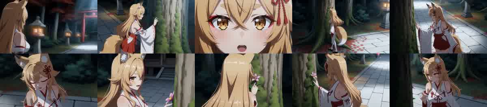
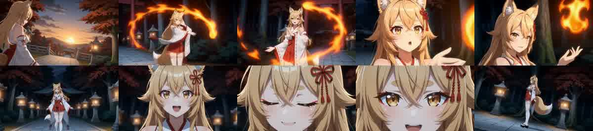

# Shot接続器 P0：採用Plan・EMD・H3映像の出典と時間軸

2026-09-24。これは[旧8B三要素の統合後の改善計画](legacy-8b-integration-next-plan-2026-09-23.md)のP0である。保存済み成果物だけを読み取り、推論・レンダリング・本番コード変更は行っていない。目的は「LLMの演技」「外部候補」「Shot配置」「Compiler」「H3」を推測で一つの原因にまとめないことである。

## 先に確定した出典

完成動画のディレクトリ番号とPlanner出力のディレクトリ番号は一致しない。MP4に埋め込まれたComfyUI `prompt` の `MVDirectorLoadTextFile.file_data_base64`を復号し、SHA-256で保存Planと照合した。

| 完成動画 | 埋め込みPlanと一致した保存Plan | 対応するEMD | 判定 |
|---|---|---|---|
| `C:\Software\ComfyUI\output\h3_chains\mv_director_context_loop-6\final\t2v_normal_2026-09-23.mp4` | `C:\Software\ComfyUI\output\mv_director-5\context_loop_plan_00001.txt`、SHA-256 `7A1B6307B89FC0CBFEDFC2C923EA13D7109D8A4928BDE9880A05DF771EB26EC5` | `C:\Software\ComfyUI\output\mv_director-5\context_loop_emd_00001.md`、SHA-256 `46894F43A2ACD92033076DAF081D9FEAD43CF02E36BB1F4BB39FB1C5117A0B77` | 埋め込みPlanの16 Sceneと`h3_plan.editor_plan`の16 promptが全件一致 |
| `C:\Software\ComfyUI\output\h3_chains\mv_director_context_loop-7\final\t2v_normal_2026-09-23.mp4` | `C:\Software\ComfyUI\output\mv_director-6\context_loop_plan_00001.txt`、SHA-256 `A53C469A43C9AB4A4A71973DCCE1850D5983A7833CCDE943E283A1FC0C01BE21` | `C:\Software\ComfyUI\output\mv_director-6\context_loop_emd_00001.md`、SHA-256 `D7B6BFD9348A3179136085F79514DCB34BAAECD6B8537799BF56512E045CCF4D` | 追加の出典照合。以下の詳細時系列は上段の動画に限定 |

既存の[全16 Sceneオフライン試験](scene-composition-full-sequence-review-2026-09-23.md)で使った`mv_director-6/context_loop_emd_00002.md`は別の生成結果であり、上記`video -6`の採用EMDとして評価しない。MP4内グラフの`basename=context_loop_plan_00001.txt`だけでは同名ファイルを識別できず、復号した実バイト列のハッシュが必要だった。

`video -6`の埋め込みグラフは人物参照`image001_mikofox.jpg`、背景参照`image002_keinai.jpg`、H3 Hybrid LoaderのFL2VA baseとRef2VA overlay、既定8 stepsを記録する。Scene 3・4・9の実seedはそれぞれ`12397252966780765306`、`10028981146477534337`、`1945693048366462725`。3 Sceneとも`continuation_mode=guide`、`context_length=22`である。これは再現条件の記録であり、同seedの再レンダリングをP0では行っていない。

## 苔→花、狐火の時刻照合

以下の「先行」は**Shot指示の開始時刻と明示的な歌詞行の開始時刻の差**である。物理的な指先の接触がその瞬間に始まったとの断定ではない。歌詞の前行からの連想や作者意図を否定する数値でもない。

| Scene / 対象 | 最初のEMD Shot指示 | 明示歌詞の開始 | 指示の先行 | H3へ届いた位置 |
|---|---|---|---:|---|
| 3 / 苔 | 00:20.042、既に大樹の根元の苔を対象とし、手を上げて接触を準備。接触Shotは00:24.667 | `苔へと還る` 00:25.380 | 対象5.338秒、接触Shot0.713秒 | `[reference generation]`と`[Shot 1]`に大樹の根元と苔。`[Shot 2]`に指先の接触と左Arc |
| 4 / 花 | 00:29.250、苔と花の間を対象とし、指先で花を撫でる。次Shotは00:34.208に手を下ろす | `人は花より` 00:33.400 | 接触を含むShot指示4.150秒 | `[reference generation]`と`[Shot 1]`に花の接触。`[Shot 2]`は接触後の解放。両Shotとも左Arc |
| 9 / 狐火 | 01:14.583、右手の円運動と人物周囲を旋回する狐火。次Shotは01:19.542に手を下ろす | `狐火へ問う` 01:21.260 | 狐火指示6.677秒 | `[reference generation]`と`[Shot 1]`に狐火の旋回。`[Shot 2]`にも旋回を継続。両Shotとも左Arc |

最初の二SceneはEMDで共に`継続`だが、Scene 3の「大樹の根元の苔」からScene 4の「石畳上の花」へ、対象と人物位置をScene先頭で新しく指定している。直前の接触点・手の終端姿勢・Cameraの到達位置をScene 4の開始位置として明示的に引き継ぐ欄はない。Scene 9も同一Scene内の二Shotに同じ旋回を繰り返し記述するため、一回の発生→巡回→解放なのか、再発生なのかは散文から一意に確定できない。

上のフレーム列でも、大樹・苔の場所は苔の歌詞以前の約22秒、花は花の歌詞以前の約32秒、炎の輪は狐火の歌詞以前の約76秒に既に見える。2秒間隔の静止画なので、接触の厳密な瞬間、Cameraの瞬間速度、Scene境界の連続性は判定しない。一方、対象を早く画面に置く原因がH3だけにあるとは言えない。**採用EMDの最初のShotで先行し、Compilerの英文にも保存されている。**

## 責務境界と未取得の証拠

| 段階 | P0で確認できたこと | 確認できないこと |
|---|---|---|
| 歌詞・時刻 | EMDの原文と開始時刻、Scene/Shot境界 | 歌詞を前倒しする作者意図の有無 |
| ユーザー演出候補、選択Event | 最終EMD内の対象・動作の文面 | `video -6`作成時の入力候補原文、採用ID、Eventの生出力。文面の類似だけで候補由来と断定しない |
| 素の8B演技とモーション補完 | 最終EMDの演技とCamera。対象箇所に`モーション補完`の出典行はない | 素のAction応答と合成前後差、候補の採否。現在確認できるPlanner cacheは別生成結果の一件だけ |
| Compiler | `[reference generation]`と`[Shot 1]`に対象を先行して置く実英文。`core/compiler/ref2va.py`の`_scene_prompt`はScene説明がなければ最初のShot本文をsummaryへ使う | 英訳が対象の発生時刻を新規に決めた証拠はない。既にEMDで先行している |
| H3と動画 | 埋め込みPlanとeditor Planの全件一致、モデル・seed・参照、粗い時系列での先行表示 | H3が接触・解放の細かな位相を正確に守ったかどうか。短いフレーム列だけでは分離できない |

よって現段階で強い結論は「**対象／接触をScene開始Shotへ先行配置することと、CompilerがそのShotをScene summaryへ重ねることが、歌詞前から対象を映しやすくしている**」である。8Bの語彙力不足、モーション補完の不適切な配置、Cameraの不履行を本動画だけで主因と決めない。今回の完成動画は、補完の原文・出典・採用位置が明示されるP1bのオフラインfixtureとは別であり、両者を同一実行として継ぎ合わせない。

## 次のP1へ持ち込む固定条件

比較区間はScene 3→4（苔の準備・接触から花への移行）とScene 9（狐火の発生・巡回・解放）に絞る。採用動画の基準Plan・EMDは上記ハッシュで固定する。P1bの生出力と候補採否を比較する場合は、出典が残る別のオフラインfixtureとして扱い、動画と同じ実行の生出力とは呼ばない。

次の差分は**自然文の自動生成ではなく時間上の配置**から試す。作者又はLLMが選んだ対象・短い位相原文を保持し、歌詞の該当行が始まるShotで主動作を開始できるか、準備を前Shotに残しても対象の具現化を前倒ししないか、解放を次Shotへ一回だけ渡せるかをオフラインで比較する。`継続`Scene境界では直前の採用終端とCamera到達点を参照し、作者固定Shotを上書きしない。`[reference generation]`がSceneの最初のShotを要約する現在の経路も同じ試験で確認し、対象をそこへ書いたまま「後で出現」を自然文で要求する矛盾を作らない。これを満たすまでは全編H3を再生成しない。

旧8B/27B映像の良い長尺Sceneと具体的な手元→全身→表情の連動は[旧版比較](japanese2json-prompt-generation-comparison-2026-09-21.md)に記録済み。ただし旧版と本動画ではモデル・設定や入力briefが一致しないため、P1の定量対照に混ぜない。
